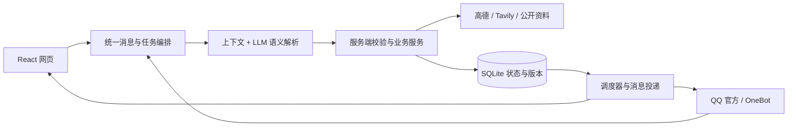

# 彼岸 · 旅行 Agent

一个从旅行资料研究、行程规划到出行提醒的 AI Agent。支持 **本地 Web** 和 **QQ** 两种交互入口：QQ 离线时，仍可在浏览器里使用同一套核心能力。

模型负责理解需求、识别上下文和选择工具；Python 服务负责查询真实数据、校验权限、保存版本与执行任务。行程、资料、提醒和任务状态持久化到 SQLite，重要修改先预览、再确认。

[Web 使用指南](docs/guides/web.md) · [QQ 使用指南](docs/guides/qq.md) · [全部指南](docs/guides/README.md)

## 能做什么

| 能力 | 使用示例与行为 |
| --- | --- |
| 联网研究 | “帮我搜索武汉三日游攻略”，汇总公开来源并标注检索时间；支持继续根据研究结果规划 |
| 行程规划与修改 | 规划 1–14 天城市行程，保留日期、必去地点和资料来源；修改同一份行程并记录版本 |
| 理解后续偏好 | “轻松一点，尽量步行或公交地铁，少打车”，结合已有行程生成预览，保留城市和日期 |
| 天气、地点与交通 | 查询天气、预报、地点和驾车／步行／公共交通路线；基于高德结果展示依据 |
| 文档与图片 | 导入 TXT、Markdown、DOCX、XLSX，检索相关片段；理解图片、提取预约规则 |
| 提醒与定时查询 | 一次性文字提醒、行程关联预约提醒；到点查询天气或路况；监测预约规则变化 |
| 偏好记忆 | 明确保存长期旅行默认，本次要求优先；当前行程修改与长期记忆分别处理 |
| 可恢复任务 | 持久化队列、取消、失败重试与重启恢复；网页会话删除同步清理关联任务及附件 |

例如，一次完整交互可以是：

```text
帮我搜索武汉三日游攻略
根据研究结果规划行程，10月1日到10月三日
我喜欢轻松一点的行程，不太喜欢打车，尽量步行或者公交地铁出行
确认行程修改
```

请将示例日期替换为实际出行日期。系统会继承已有行程信息，存在歧义时只追问缺少的部分；关联提醒变化会一并展示供确认。

## 选择入口

| 入口 | 适合场景 | 运行方式 |
| --- | --- | --- |
| **本地 Web** | 日常使用、调试 Agent、上传资料与管理多会话 | `python run_web.py`，默认 `http://127.0.0.1:8080` |
| **QQ · NapCat / OneBot** | 在已有 QQ 群内交互和接收提醒 | NapCat + 本地或服务器上的 OneBot 后端 |
| **QQ · 官方 Bot** | 已具备 QQ 开放平台应用与消息能力 | `python run_bot.py` |

Web 无需 QQ 凭据、NapCat 或 Docker。QQ 与 Web 默认使用独立数据目录；聊天和附件不会自动跨入口同步。Web 当前是单使用者的本机应用。

## 快速开始：Web

准备 **Python 3.11** 和 **Node.js 24**，在项目根目录执行以下 PowerShell 命令：

```powershell
python -m venv .venv
.\.venv\Scripts\Activate.ps1
python -m pip install -r requirements-web.txt -c constraints-py311.txt
Copy-Item .env.example .env
cd frontend
npm ci
npm run build
cd ..
python run_web.py
```

已有 `.env` 时跳过复制；已有 Python / Conda 环境可直接使用。Linux/macOS 使用 `source .venv/bin/activate` 和 `cp .env.example .env` 替换对应命令。

在 `.env` 或网页“状态与设置”中填写模型 `LLM_API_KEY`、`LLM_BASE_URL`、`LLM_MODEL_ID`，以及高德 Web 服务 `AMAP_API_KEY`。联网搜索另需 Tavily `SEARCH_API_KEY`。模型需支持 Chat Completions 与工具调用，识图还需支持图片输入；设置修改后重启后端。

首次构建后，日常运行只需 `python run_web.py`；Windows 也可使用 `start-web.cmd`。Node.js 仅用于前端开发和构建。端口、备份、删除会话、偏好范围及故障排查见 [Web 使用指南](docs/guides/web.md)；群配置与部署见 [QQ 使用指南](docs/guides/qq.md)。

## 核心设计与技术栈



- **前端**：React 19、TypeScript、Vite、原生 CSS；提供聊天、资料、行程与设置界面。
- **后端**：Python 3.11、FastAPI、Uvicorn；统一事件契约与领域服务对接不同入口。
- **Agent**：兼容 OpenAI Chat Completions 的模型接口、结构化意图、受约束的工具调用、按任务组织的上下文。
- **存储与检索**：SQLite、FTS5 文档检索、文件缓存；不要求额外部署向量数据库。
- **执行机制**：持久化输入队列、租约与版本校验、Outbox 投递、可取消任务及定时调度。

```text
agents/          模型调用、语义解析、上下文与行程规划
services/        研究、行程、偏好、提醒和任务业务
infrastructure/  数据仓库、模型网关、外部 API 与文件处理
app/             应用编排与依赖组装
adapters/        Web、QQ 官方与 OneBot 接入
core/            消息契约、配置、任务和执行边界
frontend/        Web 界面
tests/ · evals/   自动化测试与场景评测
docs/guides/     Web 与 QQ 使用指南
```

## 开发与验证

```powershell
python -m pip install -r requirements-dev.txt -c constraints-py311.txt
python -m pip check
python -X utf8 -m unittest discover -s tests -q
python -X utf8 scripts/evaluate_tasks.py --output evals/ci-offline.json
cd frontend
npm test
npm run build
```

离线测试使用模拟数据，不需要真实 API 密钥。CI 覆盖 Windows / Linux 后端测试，以及 Web 测试和构建。真实接口验收脚本见各入口指南；运行前需要配置对应服务，会消耗正常调用额度。

## 数据与能力边界

- 行程修改先展示候选版本，确认后提交；仅保存长期默认不会自动重写旧行程。身份与资源权限由服务端绑定。
- `.env`、数据库、上传资料和运行日志不提交 Git。数据保存在本机，但模型、搜索与地图功能会将必要输入发送至已配置的外部服务。
- 提醒和监测需要后端持续运行；本地电脑休眠或关机期间无法准时执行。提醒不等于自动预约、购票或付款。
- 天气和交通结果受数据覆盖与时效限制；开放时间、实时价格、余票及道路封闭不保证被核实。
- Web 仅支持本机访问，尚未提供多人账号和公网部署。现有 NapCat Docker 配置不代表完整 Web 容器化已经验收。

详细变更与实施记录保存在 [docs/](docs/)，使用操作统一从 [指南目录](docs/guides/README.md) 查阅。
