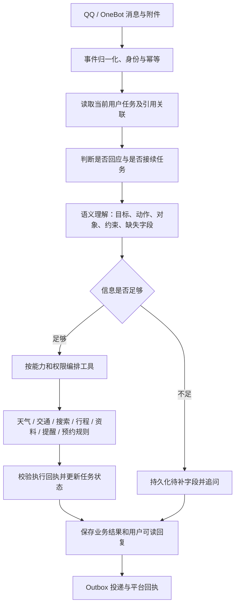

# 彼岸旅行 Agent：QQ 故障复盘与产品转型方案

日期：2026-09-08  
依据：用户提供的 QQ 测试截图、三个自然语言提醒场景，以及当前 `E:\Agent\travel_agent` 本地代码。  
文档性质：后续实施方案。本轮仅进行代码检查、临时数据库复现和文档编写，尚未实施下述修复与新功能。

## 1. 核心判断与转型方向

建议把项目定位调整为 **“彼岸 · 旅行助手：理解出行目标，帮助规划、查询、记住并推进旅行中的待办事项”**。

用户应从“我想做什么”开始交流。例如去武汉玩、规划国庆行程、查询途中天气、记住订票时间、找到合适的餐馆。图片、文件、链接、文字都是可选输入；预约是旅行事务中的一种任务，通用提醒是一项可独立使用的基础能力。

这次需要同时推进三件事：

1. 修复 QQ 多轮会话链路，让“问天气 → 补城市 → 真正查询”闭环。现有测试通过并没有覆盖这条真实链路。
2. 建立统一任务状态与通用提醒模型，解除“必须有攻略图、预约计划、景点项目才能提醒”的数据依赖。
3. 按旅行全过程建设能力：目的地探索、行程规划、交通、天气、住宿餐饮、预算、资料和协作。提醒、预约规则、风险提示分别作为能力模块接入。

“全能”应体现为覆盖常见旅行目标、能组合能力和持续处理任务；能力受限时能够说明缺什么，并提供下一步。产品不应把未接入的票务库存、真实预订或支付包装成已完成能力。

本文使用的 Agent 设计原则是：目标与任务状态显式化、模型负责语义理解与规划、工具提供可核验事实、业务程序负责权限和状态变更、缺信息可以澄清、执行结果必须可追踪。它们是本项目的工程设计准则，不是某个统一的行业认证标准，也不要求重写成指定框架。

## 2. QQ 天气测试复盘：故障已在本地代码中复现

### 2.1 截图实际说明了什么

| 对话阶段 | 截图表现 | 判断 |
| --- | --- | --- |
| “这份文件我晚点发”“明天一起吃饭” | 截图中没有 Bot 回复 | 与普通群聊不自动响应的目标一致 |
| @ 彼岸“现在天气怎么样” | 追问需要查询哪个城市 | 本轮确实进入了天气澄清流程 |
| 直接回复“武汉” | 截图中没有 Bot 回复 | 待补城市的任务未被有效接续 |
| 再次 @ 彼岸“武汉” | Bot 反问含义，并声称本轮没有天气工具 | @ 使事件进入处理，但原天气任务没有恢复，工具集合为空 |

因此，优先排查的是“会话事实如何保存、短回答如何接续、工具如何根据接续后的任务绑定”。截图不能证明高德 API 故障；当前已经找到的错误发生在天气工具执行之前。

### 2.2 直接原因：OneBot 回复字段与存储契约不一致

当前代码链路：

```text
TravelAgent 产生澄清文本
→ OneBotReplyRenderer.render 返回 {"message": "请告诉我需要查询哪个城市的天气？"}
→ prepare_event_outbox 调用 _payload_reply_text(payload)
→ 提取器只识别 content、markdown.content，不识别 message
→ prepared_reply 被保存为空字符串
→ 消息实际发送成功，mark_outbox_sent 将空字符串写入 conversation_turns.assistant_content
→ resume_weather_request 无法判断上一轮是在问城市
```

随后出现两条分支：

- 未 @ 的“武汉”：触发策略读取最近轮次，找不到天气澄清，于是只观察、不处理。
- @ 后的“武汉”：接入允许处理，但 `TravelAgent.run` 仍未恢复天气任务；`decide_travel_action("武汉")` 判为 `general`，允许工具为空。模型只能看到零散上下文并作出解释。

代码定位以本轮检查时的本地行号为准：

| 文件 | 位置 | 作用 |
| --- | --- | --- |
| `adapters/onebot_app.py` | `OneBotReplyRenderer`，约 117 行 | 返回 OneBot 的 `message` 字段 |
| `infrastructure/memory_store.py` | `prepare_event_outbox`，约 875 行 | 从渲染后的 payload 反向提取业务回复 |
| 同上 | `_payload_reply_text`，约 970 行 | 缺少对 OneBot `message` 的处理 |
| 同上 | `mark_outbox_sent`，约 1212 行 | 将 `prepared_reply` 写入最近对话 |
| `agents/clarification.py` | `resume_weather_request`，约 22 行 | 通过上一条助手文本判断待补城市 |
| `agents/travel_agent.py` | 约 114 行 | 恢复请求后再绑定意图和工具 |
| `app/group_trigger_policy.py` | `should_handle` | 未 @ 的短回答能否进入业务处理 |

### 2.3 本轮实际复现结果

使用当前 `(agent)` 环境、临时 SQLite 数据库和不发送 QQ 消息的假 Transport，执行真实的 `Renderer → prepare_event_outbox → OutboxWorker → 最近轮次 → GroupTriggerPolicy` 路径，得到：

```json
{
  "renderer_field": ["message"],
  "stored_reply_length": 0,
  "unmentioned_answer_handled": false,
  "resumed_request": "武汉",
  "forced_at_intent": "general",
  "forced_at_allowed_tools": []
}
```

这是本地代码路径上的确定性复现，与截图现象吻合；没有读取实际群会话数据库来断言截图对应行的内容。

### 2.4 为什么上轮测试没发现

上轮“真实模型天气续问”测试在 `scripts/smoke_local.py` 中手工构造了包含完整追问文本的 `ConversationTurn`，再直接调用 Agent。成员隔离测试也通过 `save_turn` 直接注入对话。

这些测试验证了“如果正确历史已经存在，Agent 能否续问”，没有验证“真实 OneBot 发出的回答能否正确进入历史”。真实模型和高德可用，也不能替代渠道、应用、Outbox、记忆的串联验证。

因此，上轮 353 项测试通过的结论仍只适用于当时覆盖的路径；不能据此宣称 QQ 天气多轮任务已经端到端通过。这次人工测试补出了关键覆盖缺口。

### 2.5 修复分为止血与结构调整

**P0 止血修复：**补齐 OneBot `message` 字符串和消息段数组的文本提取；数组只抽取可展示的文本，@、图片、回复编号等作为结构化元数据处理；保留 QQ 官方 `content`、Markdown 兼容。增加完整链路回归，禁止直接注入理想化历史绕过缺陷。

**紧接着调整业务契约：**应用层在进入 Renderer 之前就持有原始 `assistant_text`。应显式持久化该文本以及 Agent 的状态结果，Outbox 只负责平台 payload 和投递。长期不应靠“从平台发送格式反向猜测业务文本”恢复任务状态。

**历史数据处理：**修复后新会话应正常。旧的空助手文本只有在保留的 Outbox payload 可可靠对应时才尝试回填；不让模型猜写历史。没有可靠来源时让用户重新发起任务，保留原始记录。

P0 验收必须覆盖：首次 @ 查询、发出追问、实际出站记忆落库、未 @ 补城市、再次 @ 补城市、重启后补城市、消息段格式，以及用户在发出澄清后立即作答的事件交错。

## 3. 产品范围：预约退回能力模块，旅行目标成为主入口

### 3.1 建议的能力布局

| 能力 | 用户表达 | 当前基础 | 转型后的重点 |
| --- | --- | --- | --- |
| 目的地与玩法探索 | “国庆想去湖北玩三天，别太累” | 有 LLM 和文档问答 | 提取约束、补充必要信息、查证时效信息、给出可调整方案 |
| 行程规划与修改 | “第二天改成室内，同行有老人” | 已能解析部分行程日期 | 结构化每日计划、交通时间、开放限制、用户修改与版本 |
| 天气与出行条件 | “那武汉明天呢？” | 有天气和预报工具 | 跨轮地点/日期状态、工具覆盖日期、证据与限制 |
| 交通 | “从武汉站到博物馆怎么方便？” | 目前以驾车路线和路况为主 | 分开建模步行、公交、驾车、铁路等模式；按数据源实际接入开放能力 |
| 住宿与餐饮 | “住哪里方便，预算每晚 400” | 尚无专用实时搜索能力 | 地点、预算、交通便利度；营业、价格、库存需注明来源和时间 |
| 通用提醒与待办 | “明天提醒我抢高铁票” | 调度基础存在，但与景点预约强耦合 | 文字直接创建、补时间、修改、取消、重启可恢复 |
| 预约与订票准备 | “10 月 1 日去省博，开约时提醒我” | 有景点预约与日期计算 | 根据游览目标查询规则、计算开约时间、生成提醒 |
| 资料整理与问答 | “这张票哪天用？行程里住哪家酒店？” | 支持文档、图片输入 | 所有输入进入统一资料层，按任务解释，不默认理解成预约图 |
| 预算与协作 | “我们四个人均预算 2000，帮我列清单” | 群聊与身份上下文存在 | 先做预算计划、清单和明确的群共享事项；真实消费账本可后续扩展 |

首个可交付版本应包含可靠的多轮查询、通用提醒，以及少量可组合的旅行能力。目的地、住宿餐饮等可逐步接入搜索工具，不能仅靠修改系统提示词就宣布完成。

### 3.2 保留哪些已有投资

保留 `ChatEvent`、Transport、Renderer 的接入边界；保留 SQLite、Outbox、日期纯函数、身份绑定、幂等键、数据库版本检查、文档来源与确认边界。

重点改变：预约工作流主导的应用分支、按单句领域词绑定工具、依赖助手措辞恢复任务、图片必先进入“制定预约”、提醒必须引用景点项目的模型。

项目名称可以采用“彼岸旅行 Agent / Beyond Travel Assistant”。README 第一屏应展示“表达目标 → 自动查信息/补槽位 → 给出结果或安排待办”，帮助菜单按旅行任务组织。品牌更名应与第一批新交互一同发布，避免只换标题。

## 4. 三个提醒场景应如何工作

以下日期示例仅为说明产品语义，假定用户消息发生于 **2026-09-08，时区 Asia/Shanghai**；运行时必须使用真实事件时间，不把这个日期写死。

### 4.1 “@彼岸 明天提醒我抢高铁票”

识别为 `reminder.create`：事项“抢高铁票”，日期 2026-09-09，时间缺失。

推荐对话：

> 彼岸：明天几点提醒你抢高铁票？
>
> 用户：上午十点。
>
> 彼岸：已设置：9 月 9 日 10:00 提醒你抢高铁票，到时在本群 @ 你。可以说“改成九点半”或“取消这条提醒”。

这里不需要追问车次、起终点、出行日期，也不需要攻略图、行程单或预约计划。那些信息不是创建“用户指定时间的提醒”所必需的。

不要根据“抢高铁票”擅自改成“查询车次开售时间”。只有用户要求“开售时提醒”时，才进入票务规则解析任务。

### 4.2 “9 月 20 号提醒我预约湖北省博物馆”

识别为**在指定日期提醒做一件事**。这里的 9 月 20 日是提醒日期，不能当作参观日期，也不必先研究博物馆预约政策。

> 彼岸：9 月 20 日几点提醒你？
>
> 用户：早上九点。
>
> 彼岸：已设置：2026 年 9 月 20 日 09:00，在本群提醒你预约湖北省博物馆。

若用户已明确配置“日期型提醒默认上午九点”，可使用该偏好直接创建并在回执中写出完整时间；没有偏好时，不应悄悄选一个默认时间。

### 4.3 “我想 10 月 1 日去看湖北省博物馆，到了可以预约的日期提醒我及时预约，我怕忘了约”

识别为**由出行目标推导触发时间的预约提醒**：参观目标是湖北省博物馆，参观日期为 2026-10-01，提醒时间需要规则推导。

处理顺序：

1. 解析并核对场馆实体。存在分馆、特殊展览或日期歧义时才补问。
2. 查询场馆官方预约说明：开放预约范围、放票时刻、适用日期、节假日例外、个人/团队区别等。
3. 保存可核验的来源及规则版本，用确定性程序计算该参观日对应的开约时间。
4. 在规则明确、有效期覆盖目标日期时，按用户“开约时提醒”的授权创建提醒；回执写出完整日期、时间、规则摘要及来源。
5. 规则不足以确定时间时，明确说明缺失信息，提供“补官方链接/说明”或“改为自己指定时间提醒”的继续方式。不能先回复“已经设置”，留下一个不会触发的任务。

推荐回复模板：

> 我查到官方说明为「经核实的规则摘要」。按你 10 月 1 日参观计算，预约开放时间是「确定的年月日时分」。已设置届时提醒，来源：「官方页面」。这条任务只提醒你预约，不代表已经取得参观名额。

若缺少可核实的规则：

> 我还没查到能确定 10 月 1 日开约时刻的官方说明。你可以给我官方链接或截图，也可以先指定一个时间提醒；目前还没有创建开约提醒。

**本文没有查询或确认湖北省博物馆当前预约政策，不提供其真实提前天数、放票时刻或节假日规则。任何后续实现都不能把示例值当真实业务规则。**

### 4.4 两类时间语义必须分开

| 类型 | 时间由谁确定 | 需要哪些最少字段 | 是否需要外部规则 |
| --- | --- | --- | --- |
| 指定时间提醒 | 用户 | 事项、触发时间、接收人和渠道 | 不需要 |
| 预约开放提醒 | 用户提供参观目标，程序根据规则推导 | 场馆、参观日期、有效预约规则、接收人和渠道 | 需要 |

两者最终都可产生同一种提醒记录，但任务来源和证据不同。图片与行程只能帮助填字段，不是任何一种提醒的先决条件。

## 5. 统一任务驱动架构

### 5.1 每条消息经过的主要步骤



关键顺序：**先恢复任务，再判断当前动作和分配工具。** “武汉”“上午十点”“改成 25 号”本身没有足够的领域词，必须结合当前任务中的待补字段解释。

### 5.2 任务状态必须独立于自然语言历史

建议持久化一个最小 `Task`：

```text
task_id、platform、scope_id、owner_id、trip_id（可空）
task_type、status、slots、missing_slots、constraints
resource_refs、source_event_id、last_event_id、version
pending_question、question_event_id、expires_at
created_at、updated_at
```

其中 `slots` 保存结构化字段及其来源，例如“地点=武汉，来自用户这次消息”“日期=2026-10-01，来自用户明确参观目标”。`trip_id` 可空，用户创建一般提醒不需要先创建旅行。

建议任务状态：`collecting`（补信息）、`ready`、`running`、`waiting_external`（等待外部事实）、`completed`、`failed`、`cancelled`、`expired`。`needs_input` 可以是本轮交互结果，落到任务时表示 `collecting` 及具体 `missing_slots`。

天气问题缺城市时，保存 `task_type=weather_query`、`missing_slots=[location]`，再发追问。下一条“武汉”直接填地点；不需要识别上一条回复是不是某种固定句式。完成一次查询后，可保留可过期的地点/日期上下文，以支持“那明天呢”，但不把已完成任务永久视为仍在等待答案。

任务状态应在回复入 Outbox 前与业务结果一起提交。不能把是否进入等待状态，依赖于出站 HTTP 响应是否及时返回。平台回复消息 ID 后续用于增强引用关联，不作为最初持久化任务的必要条件。

### 5.3 群聊接续规则

默认按平台、群、用户隔离任务。群共享旅行、个人提醒分别建模；别人的一句“武汉”不能补完我的天气任务。

推荐优先级：明确回复某条任务消息 → 本用户当前待补任务 → 明确新请求 → 一般聊天。存在多个可匹配待补任务时进行一次有具体选项的澄清，不按“最近一个任务”盲目写入。

用户可中断、切换和返回任务。例如正在补提醒时间时问“武汉现在下雨吗”，应允许先查询天气，保留未完成的提醒；之后“刚才那条提醒上午十点”能继续。MVP 可以限制每个用户只有一个前台补槽任务，但必须提供显式切换，并保存被暂停任务。

普通群聊继续不自动回应。发送明确的“提醒我……”可直接触发；“我提醒一下大家早点来”“明天一起吃饭”不应创建提醒。复杂语义由模型产生结构化候选动作，程序验证必要参数、权限及明确的用户请求。

### 5.3.1 补充：用 NapCat 的发送者标识关联连续消息（2026-09-09）

用户提出利用 NapCat 日志中“群名（群号）＋账号名（QQ 号）”判断后续消息归属。这一观察可以落实为稳定的任务关联规则，但生产入口应优先使用 OneBot 上报的结构化事件，而不是解析日志中的显示昵称。

日志示例中的群名、发送者昵称、发送者 QQ 号和被 @ 的机器人是不同字段。对应的结构化信息一般包括：

| 字段 | 用途 |
| --- | --- |
| `self_id` | 标识接收事件的机器人账号；支持多机器人部署时参与隔离 |
| `group_id` | 区分消息所属群，同一个用户在不同群的任务默认不相互补槽 |
| `user_id` | 稳定的发送者身份，映射为 `ChatEvent.sender_id`；不能用被 @ 对象的 QQ 号替代 |
| `sender.card` / `sender.nickname`（若上报） | 群名片或昵称，仅用于展示和帮助模型阅读；可能重名或改名 |
| `message_id` / `time` | 事件去重、关联和时序判断；时间戳本身不能作为唯一消息 ID |
| `message` 中的 `at` / `reply` 段 | 判断是否明确对机器人说话、是否引用某个任务；与真实发送者身份分开 |

当前代码已在 `OneBotAdapter._group_event` 中从 `group_id`、`user_id` 和 `message_id` 构造 `ChatEvent`；`_handle_group` 对未触发回复的普通消息也有 `save_chat_message` 观察入库路径。因此，在 NapCat 将普通群消息上报到本服务的前提下，未 @ 不代表收不到，且程序已经能知道是谁发送。截图中的天气问题主要仍是上一节已复现的回复存储和任务接续缺陷，而非缺少发送者昵称。

建议把归属与接续分成两个确定步骤：

1. **消息归属由程序确定。** 当前单机器人实例以 `(platform, group_id, user_id)` 找到该成员的任务；将来共享数据库支持多 Bot 时增加 `self_id`。发送者来自通过鉴权的事件元数据，不由 LLM 根据正文、昵称或用户粘贴的日志猜测。
2. **是否补充当前任务结合语义判定。** 同一用户存在有效的 `collecting` 任务、缺失字段为城市，且后续“武汉”与字段兼容时，直接补城市并继续查询。若后续是“明天一起吃饭”，不能仅因发送者相同就塞进城市字段；明确切换任务、引用对象不符、多个候选任务或语义不清时，另行处理或澄清。

给模型的上下文应包含程序已关联的任务 ID、当前发送者标识、可选显示名、待补字段、关联依据和本轮内容。例如“同一成员的天气任务正在等待 location；本轮输入武汉”，而非让模型阅读整段日志自行辨认账号。自然语言只能提出字段候选，程序仍负责身份、权限和资源版本校验。

需要区分三种故障并记录诊断：

- NapCat 控制台出现日志，但 Python 接入没有收到该 `message_id`：检查 HTTP 上报或所用连接、过滤配置及鉴权；日志存在不证明事件已经送到应用。当前项目使用 HTTP 上报路径。
- 接入已收到事件，结果为 `observed`：检查任务恢复与触发理由，区分正常静默和错误漏触发。
- 接入为 `handled`，却没有合适的工具或没有完成任务：检查关联的 Task、槽位和工具路由。

日志用于对照排障和受控离线复现，不作为默认第二条自动执行输入流。若未来确需日志导入，必须定义格式、可信文件来源、去重、时区、缺失消息 ID 的处理以及实时事件的互斥；旧日志不能直接重放出提醒创建等副作用。

新增验收：未 @ 的同用户城市补充；同昵称不同 QQ 号；改名但 QQ 号不变；同用户跨群；他人插话；同用户闲聊或切换任务；缺失发送者 ID 时拒绝猜身份；NapCat 收到但 HTTP 未上报的诊断；事件重复和乱序。实际未 @ 接收能力仍需要用当前部署进行端到端验证。

### 5.4 模型、程序与工具分别承担什么

| 层次 | 责任 |
| --- | --- |
| 模型 | 理解自然语言、识别意图和对象、提取候选字段、提出最小必要澄清、规划工具步骤、整理解释 |
| 任务管理器 | 接续、版本、所有者、任务切换、缺失字段、取消和恢复 |
| 确定性业务服务 | 时间计算、规则校验、幂等、确认边界、数据库事务、提醒创建和修改 |
| 工具与数据源 | 实时天气、路线、搜索、官方规则、文档片段；返回状态、证据和数据时间 |
| 投递系统 | 到期扫描、生成提醒事件、Outbox、失败重试、投递结果与回执 |

允许模型提出多步操作，但“模型说已完成”不能推进业务状态。继续沿用上轮建立的工具回执与数据库版本检查，并让协议覆盖 `needs_input`、部分成功、外部规则缺失和重试条件。

## 6. 通用提醒的数据与执行模型

### 6.1 为什么不能只给现有工具再加几条自然语言规则

当前 `reservation_plans.image_id` 非空，`reservation_reminders.reservation_item_id` 非空，提醒扫描和文案依赖参观日期、预约日期及景点名称。把“抢高铁票”硬塞成一个景点，会继续污染用户交互、数据结构和过期判断。

不要为纯文字提醒创建假图片、空景点或虚假游览日。应新增独立提醒模型，保留旧预约数据的兼容层。

### 6.2 最小领域对象

| 对象 | 核心信息 | 与现有系统的关系 |
| --- | --- | --- |
| `Task` | 用户目标、槽位、任务状态、版本 | 替代各功能通过文字历史猜流程的方式 |
| `Reminder` | 标题/事项、所有者、投递目标、时区、触发时间、状态、版本、来源任务 | 不依赖预约或图片，可独立存在 |
| `ReminderOccurrence` | 一次到期实例、原定时间、处理状态、Outbox 关联、唯一键 | 供统一调度；一次性提醒也只有一个实例 |
| `ReservationRequest` | 场馆、参观日期、预约类别、规则来源、规则状态、派生提醒 | 预约业务扩展，创建后可派生通用提醒 |
| `Evidence` | 来源 URL/文档 ID、引用片段、检索时间、适用范围、版本 | 延续现有来源追溯能力 |
| `Trip` | 目的地、时间段、同行者、预算、约束、行程版本 | 后续旅行规划主体；提醒可选择关联 |

MVP 只实现一次性提醒。重复提醒、按工作日排程、提前多次通知可以后续接入；不要让用户最基础的“明天十点提醒我”等待完整日历系统开发完成。

### 6.3 时间处理规则

- 使用事件时间和用户时区解析“明天”“今晚”；SQLite 保存 UTC 触发时间，同时保留用户时区、原始表达、规范化结果和解析来源。
- 缺年份、上午下午或具体时刻时，按明确的产品规则处理。未来月日可选择最近未过去日期，但回执必须显示年份；涉及跨年和已有旅行日期冲突时补问。
- “10 月 1 日去”“9 月 20 日提醒”分别映射 `visit_date` 与 `remind_at`，不共用一个含义模糊的 `date` 字段。
- 过去时间不能无声顺延一年。已过期、恰逢当前时刻、时区变更和夏令时都应有明确测试；初版以北京时间默认使用，架构保留时区字段。
- 若用户希望按铁路开售时间提醒，需要补齐相关车次/站点/乘车日并取得适用来源；不能用一个固定放票时刻覆盖所有车站。
- 不自动继承景点预约的默认双提醒。普通一次性提醒默认一次，额外提醒由用户要求或已确认的偏好决定。

### 6.4 低摩擦创建与必要确认

用户明确说“明天上午十点提醒我抢票”，字段完整、目标是本人且渠道明确时，**直接创建并返回回执**，不要求额外输入计划编号或再确认一次。

缺字段时只问缺的字段；收到补充后继续原授权。用户确认过的个人默认时间可减少后续追问。

涉及多个可能对象、批量修改、来源规则变化导致已安排时间改变、提醒他人或群共享事项时，展示具体影响再确认。是否需要确认由操作含义决定，而非所有写工具统一多一轮。

### 6.5 查询、编辑和取消

基本表达包括：“我有哪些提醒”“把刚才那条改成九点半”“抢高铁票那条不用提醒了”“这次旅行的提醒都列出来”。内部可以有稳定 ID，但用户不应每次都复制 `R-`/`A-` 编号。

通过回复关联、当前任务和用户自己的提醒列表解析对象。多条同名提醒时列出日期/事项让用户选择。编辑必须携带预期版本；取消待办、取消提醒投递、取消真实订单是不同操作，回复不能混淆。

### 6.6 可靠投递与用户可理解状态

提醒建立成功与消息投递成功分开记录。只有数据库事务提交后才能回复“已设置”；失败应说明没有创建成功。

到期实例以稳定唯一键入 Outbox，重放不能生成多个相同实例。修改时间应废弃旧的未投递实例；已被发送 Worker 领取的提醒通过版本/取消状态复核，仍可能有无法撤回的在途消息，需要如实反馈。

短暂宕机后可按可配置的补发窗口补发并标注延迟；过久的提醒列入错过事项，不无限补发。白名单移除、机器人退群、私聊不可达应形成可查询的阻塞状态。发送响应丢失时保留“结果未知”，不宣称端到端恰好一次。

QQ 群中创建提醒，MVP 默认到期在同一群 @ 创建者，并在创建回执说明。私聊提醒只有在该渠道确实接入且验证可达后开放，不能默认承诺。

## 7. 预约规则：从“读攻略”升级为“解析目标并查证规则”

建议新增 `ReservationPolicyResolver`，负责实体识别、证据检索、规则提取和适用性检查；`BookingWindowCalculator` 负责纯日期计算。现有提前自然日/月、月末回退等函数可以复用，但不能代替所有场馆的开放规则。

规则记录至少区分：适用场馆/展览、人群、可预约日期范围、日历或滚动放票方式、放票时刻、时区、例外、来源和更新时间。对于“提前 N 天”必须确认边界是否包含当天，而不是统一机械减 N。

来源优先为场馆官方预约说明、官方公告及被其明确链接的预约平台；其他攻略仅作为线索。用户上传资料同样保留来源与版本，不当成永远有效的规则。

搜索、网页读取和规则提取是新能力，当前代码尚未完整具备。官方信息可能位于公众号或小程序，工具无法读取时应承认缺口，允许用户补充原文或转换成指定时间提醒。

预约规则明确时才创建派生提醒；`waiting_external` 任务必须有下一次检查时间、截止时间和用户可见状态，不能无限等待。监测政策变更应作为明确的产品选项，设置频率、终止时间和通知条件，而非默认持续抓取。

假如规则更新使已建立的提醒时间变化：保留旧证据，形成差异，按用户授权策略更新；未授权自动调整时先让用户确认。新规则表明已开放时，反馈当前状态并询问是否现在提醒或转为另一个时间，不创建一个落在过去的无效定时器。

## 8. 旅行能力如何组合

以“国庆去武汉三天，想去湖北省博，带老人，帮我安排并提醒预约”为例：

1. 识别父目标“武汉三日旅行”，保存日期、同行者与节奏约束；只追问缺少且会影响规划的关键字段。
2. 查询景点开放信息和交通可达性，形成可解释的行程草案。未来天气超出数据源范围时说明暂不可查，不拿当前天气冒充国庆预报。
3. 将省博参观目标交给预约规则能力，生成预约提醒子任务；行程可以先完成，规则查询未完成的部分单独标明。
4. 用户改成“省博放第二天”，更新行程版本，并检查派生预约提醒是否需要重新计算；向用户展示受影响事项。
5. 行前按明确设置提供天气、出发和预约待办提醒。长期后台动作必须持久化，不能只在聊天中答应。

一个父任务可以包含多个有依赖的步骤。初期使用单一编排器和模块化工具即可；互不依赖的外部只读查询可并发，同一资源上的修改与确认顺序执行。是否引入 LangGraph 或多 Agent，应以恢复复杂度和评测收益决定。

## 9. 对现有代码的实施映射与迁移

| 现有位置 | 建议变化 | 保留的边界 |
| --- | --- | --- |
| `adapters/onebot_app.py` | 明确业务文本与平台消息段的转换；保存平台消息回执关联 | 验签、白名单、事件归一化 |
| `app/bot_application.py` | 从大量预约优先分支逐步转为任务接续、能力路由、结果持久化 | 事件租约、Outbox、固定命令可用性 |
| `app/group_trigger_policy.py` | 从领域词触发改为明确请求/引用/待补任务触发 | 普通群聊不打扰、同用户同群隔离 |
| `agents/clarification.py` | 文本匹配只作为旧会话兼容；新增任务状态驱动接续 | 简单确定性澄清仍可保留 |
| `agents/travel_decision.py` | 产生动作和对象的结构化候选，结合任务状态决定工具范围 | 工具白名单、资源与权限约束 |
| `agents/context_builder.py` | 当前任务和待补字段优先，随后近期对话、相关证据与群聊 | 非可信资料隔离与上下文预算 |
| `agents/travel_agent.py` | 输出统一交互结果；支持补槽、部分完成与外部等待 | 回执判定、调用预算、实时事实需工具 |
| `tools/` | 新增通用提醒、任务查询、规则查询工具；逐步整理能力注册表 | 身份由程序注入，不让模型改 owner/group |
| `services/reservation_service.py` | 作为预约领域服务和旧流程兼容；图片不再是新任务必需来源 | 日期纯函数、所有权、版本和来源保护 |
| `services/reminder_scheduler.py` | 从景点专用扫描扩展到通用到期实例调度 | 重试、Outbox、可恢复投递 |
| `infrastructure/memory_store.py` | 增量迁移任务/通用提醒表，逐步按事务边界提取 repository | SQLite 与跨表事务；不同时迁移 ORM |
| README / 帮助 / 系统提示词 | 去除“青甘自驾风险助手”作为唯一身份，展示广泛旅行任务入口 | 明确已接入能力与数据局限 |

### 数据迁移顺序

1. 修复回复存储契约；增加 Task 表与任务结果字段，保留旧命令。
2. 新的文字提醒写入通用 Reminder/Occurrence 表，旧预约提醒暂由原路径投递。两类实例带独立来源标识，不能彼此重复扫描。
3. 新的预约目标经规则解析后生成通用提醒；旧图片计划通过兼容层继续查看、修改、确认。
4. 选择测试数据演练旧提醒迁移，保留 legacy ID 映射、原状态、原 UTC 时间、接收人和已发送记录；只有对账通过后才切换旧任务的调度归属。
5. 切换以同一任务仅有一个有效调度器为硬约束，避免“双写两个调度系统再祈祷去重”。回滚也要明确停用新实例，不允许两边同时恢复发送。

数据库变更需先做可恢复备份和迁移演练。验收对账关注计划/提醒数量、时间、状态、所有者和引用关系；旧数据来源未知的字段不能补造事实。

## 10. 测试与评测：从局部函数转向完整用户任务

### 10.1 四层测试

| 层次 | 内容 | 验收重点 |
| --- | --- | --- |
| 领域确定性测试 | 时间解析、预约开放计算、状态、权限、版本、幂等 | 用固定时钟、临时数据库和可控交错验证 |
| 应用整链路回归 | OneBot 输入 → 应用 → 模型/工具替身 → Renderer → Outbox → 记忆 → 下一轮 | 不手工插入理想历史，不跳过出站存储 |
| 真实模型任务评测 | 固定工具数据快照、实际模型的意图/补槽/动作选择 | 模型和提示词版本可复现，记录失败样例 |
| QQ 人工验收 | 真实 @、未 @ 续问、引用、附件、两名成员、重启和实际到期投递 | 使用隔离测试群，逐步核对实际看到的结果 |

联网工具检查和真实模型任务评测分开统计，避免 API 偶发失败掩盖决策问题，也避免工具替身通过被误写成真实接口通过。

### 10.2 必须纳入的验收用例

| 场景 | 预期行为 |
| --- | --- |
| @ 问天气，Bot 追问，直接回复武汉 | 完整出站历史已保存；接续后允许天气工具并实际查询 |
| 再次 @ 后补武汉 | 同样恢复任务，不能退回无工具闲聊 |
| 换一种追问文案、插入群聊、服务重启 | 接续由任务状态决定，保持所有者和有效期 |
| 别人回复武汉 | 不修改原用户任务 |
| 明天提醒抢票 → 上午十点 | 只需一次时间澄清，无图无行程即可创建 |
| 9 月 20 日提醒预约博物馆 | 日期解释为提醒日，不要求参观日期或查预约规则 |
| 10 月 1 日参观，开约时提醒 | 先取得适用规则和证据；未知规则不能声称已设提醒 |
| “别创建提醒，我只是问一下” | 不创建 |
| “明天提醒我查天气” | 默认建立未来提醒，不自动改成现在查天气 |
| “明天八点告诉我武汉天气” | 明确是提醒一段文字还是届时执行查询；未支持延迟执行工具时说明并给替代方案 |
| 两条相似提醒，“取消那条” | 指代不唯一时给具体选项，不随机取消 |
| 同一事件重放、修改与到期并发 | 不重复建立；旧版本不继续按旧时间排程 |
| 到期发送超时、退出白名单、进程重启 | 状态可追踪，按策略重试/阻塞/补发，不伪报送达 |
| 行程改日期、规则改放票日 | 派生提醒显示影响，按确认与版本规则更新 |
| 周末武汉两日游，带老人、预算有限 | 生成满足约束的行程并标出需查证事项，不自动转进预约图片流程 |

“未来执行一次天气查询”属于 ScheduledTask，不等同于发送预先保存文本的 Reminder。建议列入后续迭代，并限制允许的只读工具、执行预算与失败反馈；不能把所有含时间的请求都扁平化成字符串通知。

### 10.3 数据集与发布门槛

建议第一版建立约 120 个样例：20 个群聊触发与非触发、20 个跨轮补槽与切换、25 个通用提醒时间与编辑、20 个预约规则与证据、20 个综合旅行任务、15 个故障恢复与身份隔离。事先划分调试集和保留集。

统计任务完成率、正确澄清率、误触发率、时间解析正确率、证据支持率、无依据成功声明、重复副作用、提醒投递延迟、每个成功任务的模型调用与 token 成本。真实模型重复运行，报告样本量及不确定性，不用一次通过表示稳定成功率。

建议的第一版发布门槛是：固定验收集中的错误接收人、错误时间落库、越权修改、重复副作用和无依据“已设置”均为零；关键 QQ 对话连续完成；其余质量指标建立基线再比较。这里是测试集验收目标，不是对所有线上输入的零错误承诺。

日志至少关联 `event_id → task_id/version → tool_call_id → reminder_id/occurrence_id → outbox_id → 平台回执`，记录状态转移与必要输入摘要；无需保存或展示模型隐藏思维过程。

## 11. 分阶段升级路线

以下为顺序与粗略工作量，按单人持续投入估算，不是交付承诺。每阶段都要能独立验收。

| 阶段 | 范围 | 交付物与退出条件 | 粗估 |
| --- | --- | --- | --- |
| P0：QQ 闭环止血 | 修复 OneBot 文本保存，业务回复与 payload 解耦起步，补真实路径测试 | 截图对应对话在真实 QQ 中通过；旧平台兼容；明确历史空值处理 | 1–2 天 |
| P1：通用任务状态 | Task 存储、同用户补槽、任务切换、工具随任务恢复、引用关联基础 | 天气与提醒共享一套补槽机制；重启、他人插话、过期测试通过 | 3–5 天 |
| P2：通用文字提醒 MVP | 一次性自然语言提醒、时间澄清、列表、指代编辑、取消、通用调度 | 前两个用户示例无图完成，并在测试群实际到期投递；迁移/幂等检查通过 | 4–7 天 |
| P3：目标驱动预约提醒 | 场馆实体、官方来源查询、规则对象、开放时间计算与派生提醒 | 第三个示例在已核验场馆上完成；规则未知时正确降级；无臆造日期 | 1–2 周 |
| P4：旅行产品扩展 | Trip、目的地与行程、资料统一入口、首批交通/地点搜索能力、产品更名 | 至少一条“规划 → 查询 → 修改 → 待办提醒”的完整旅行任务；README 与实际能力一致 | 1–2 周 |
| P5：持续任务与规模化评测 | 延迟执行只读查询、选定规则监测、Inbox、检查点、预算/并发、评测报告 | 证明恢复与延迟收益，再决定框架和组件扩展 | 按评测结果拆分 |

P2 发布时可先更新名称、帮助和核心示例，明确已上线的旅行能力；P4 再扩展首页演示，不必等所有能力完成才能摆脱“预约攻略机器人”的入口设计。

当前不建议先扩大工具数量、接更多模型或引入多 Agent。最先产生体验收益的是 P0–P2：可靠接续、自然语言入口和独立提醒。P3 解决事实依据，P4 才有可组合的旅行体验基础。

## 12. 下一轮实施建议

建议下一次实施以 **“修复 QQ 天气闭环 + 通用任务状态 + 文字一次性提醒 MVP”** 为一个明确范围，即 P0–P2。

验收直接使用用户表达：

1. “@彼岸 现在天气怎么样” → “武汉”：查询成功。
2. “@彼岸 明天提醒我抢高铁票” → “上午十点”：建立提醒，到期在本群 @ 本人。
3. “9 月 20 号提醒我预约湖北省博物馆” → “早上九点”：按提醒日创建，允许自然语言修改和取消。

“10 月 1 日参观，开约时提醒”在 P3 接入可验证预约规则后完整开放。在此之前，系统应解释当前缺少官方规则，允许用户指定提醒时间，而不是要求先上传一张攻略图才能使用。

完成这些之后，用户能感知到的变化应是：彼岸围绕自己的目标推进任务，记得正在补什么信息，并把已经答应的事情真正落实到可查询、可修改、可恢复的状态中。
