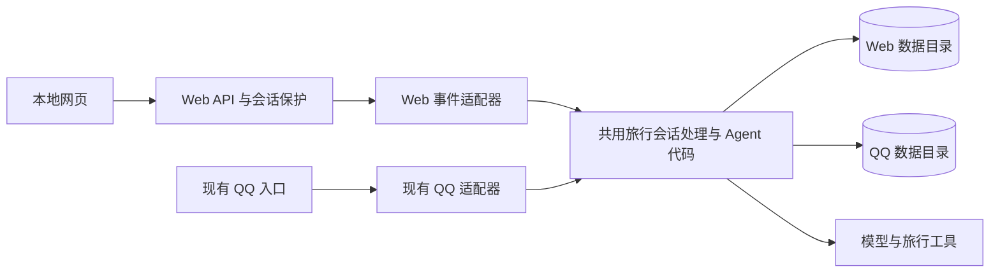

# 彼岸 · Travel Agent 本地网页交互升级方案

版本：v1.0（2026-09-18 审核通过，已实施本地网页版）  
日期：2026-09-16  
目标项目：`E:\Agent\travel_agent`  
本文保留升级设计与验收计划。实施结果见 [本地网页版交付记录](web-upgrade-acceptance-2026-09-18.md)；本轮未安装或构建 Docker，未向真实 QQ 群投递消息。

## 1. 方案结论与审核范围

新增一个可以独立启动的本地网页入口，复用现有 Agent、工具和旅行业务。QQ 正常时可继续使用 QQ；QQ 风控掉线时，打开本地网页即可测试天气、交通、行程、文档、图片、提醒等核心功能。

推荐采用 **React + TypeScript + Vite 前端，FastAPI 后端，SQLite 与本地文件持久化**。前后端分开开发，前端构建后由 FastAPI 提供，同一个本地地址完成日常使用。第一版用持久化后台任务和短轮询，不要求浏览器保持一条长请求，也不引入新的消息中间件。

本轮优先解决“核心能力具有独立于 QQ 的输入输出”。Docker 只预留端口、地址、环境配置、静态构建产物和数据目录边界，不写镜像、不部署容器。

### 1.1 推荐默认决定

| 决定 | 推荐值 | 原因与影响 |
| --- | --- | --- |
| 使用范围 | 单机、单使用者、本地测试 | 减少账号和部署负担，直接满足当前需求 |
| 访问地址 | `http://127.0.0.1:8080`，端口可改 | 与原 OneBot 常用 8000 端口错开 |
| QQ 入口 | 保留，独立启动 | QQ 掉线不影响 Web；Web 关闭不影响 QQ |
| 模型与工具 | 复用同一套代码及现有接口配置 | 测试的是原 Agent 能力，不创建另一套聊天机器人 |
| 数据 | Web 默认使用 `data/web/` | 隔离测试提醒、附件和任务，避免误投递真实群 |
| 历史同步 | 本轮不自动同步旧 QQ 会话及提醒 | 不推断 QQ 用户身份，不自动迁移共享群资料 |
| 前端风格 | 暖白背景、深青绿色主色、清晰的旅行工作区 | 兼顾旅行产品的亲和感和测试时的信息清晰度 |
| 任务反馈 | 状态与结果轮询；不做逐字假流式 | 与当前同步模型调用及持久队列契合 |
| 登录 | 无注册／密码页；本地单使用者会话保护 | 保持打开即用，但限制恶意网页跨站调用本地接口 |

**需要特别理解的数据边界：**第一版可在网页重新测试相同业务，也可重新上传旅行资料；不会自动接着 QQ 中上一句对话继续。网页中的“我的行程／提醒”指 Web 数据目录中的记录。跨入口接续如需实现，应在后续通过明确的身份关联与迁移功能完成。

### 1.2 本轮不包含

- Docker 安装、Dockerfile、Compose、镜像发布与 Linux 部署。
- QQ 登录修复、风控规避或第三方 bot 稳定性改造。
- 公网、局域网多人服务、完整账户系统、Web Push、移动 App。
- 重写 Agent 的意图识别、工具选择、规划模型或已有确认规则。
- 自动导入正式 QQ 数据，或将 Web 提醒转发至真实 QQ 群。
- 地图 SDK、实时票务、代订旅行产品、额外向量数据库。

## 2. 当前代码核对与实际改造点

以下结论来自本地代码静态检查，不等同于本轮已经运行回归测试。仓库已有大量未提交修改；实施时应以当前工作区为基线，保留用户原有改动，不能用恢复或重置操作清理工作区。

| 现有位置 | 已有基础／发现的问题 | 本轮处理 |
| --- | --- | --- |
| [core/chat_transport.py](../core/chat_transport.py) | 已有 ChatEvent、ChatAttachment、MessageTransport、ReplyRenderer；平台类型只有 QQ 官方和 OneBot | 增加 Web 平台与 Web 渲染、投递实现，复用事件契约 |
| [app/runtime_factory.py](../app/runtime_factory.py) | 可以注入 transport、renderer、store，业务组装已有复用点 | Web 创建独立 store，再调用现有组装函数 |
| [core/settings.py](../core/settings.py) | Settings.from_env 会要求 QQ 凭据 | 独立 Web 配置加载，不调用 QQ 配置校验链 |
| [app/bot_application.py](../app/bot_application.py) | private 路径主要用于 QQ 私聊文档绑定；群路径承载旅行对话；进度发送部分专用于 OneBot | 抽出共用旅行会话处理，QQ 私聊绑定留在原入口；进度输出改为可适配 |
| [services/inbox_worker.py](../services/inbox_worker.py) | 已有顺序执行、重试、取消和租约；内部多处固定 onebot，并调用 OneBot 私有解析方法 | 用少量明确的适配器接口替换直接依赖，不复制整套任务执行器 |
| [infrastructure/inbox_repository.py](../infrastructure/inbox_repository.py) | 记录包含 platform，但 claim 目前没有平台筛选参数 | 增加消费者平台范围并覆盖普通、定时、附件和恢复路径 |
| [services/scheduled_query_service.py](../services/scheduled_query_service.py)、[services/policy_watch_service.py](../services/policy_watch_service.py) | 入口存在“只接受 OneBot 群事件”的判断 | 允许 Web 的可信会话进入相同业务；不扩大原 QQ 官方能力边界 |
| [services/outbox_worker.py](../services/outbox_worker.py) | 已按平台读取待投递结果，具备重试与租约 | 新增 Web 持久化投递，解决重复投递的幂等标识 |
| [services/reminder_scheduler.py](../services/reminder_scheduler.py) | 可注入平台、渲染器和 scope 许可判断 | Web 单独启动调度与投递，提醒保存为网页通知 |
| [infrastructure/attachment_cache.py](../infrastructure/attachment_cache.py) | 附件缓存有哈希、根目录与大小校验，但流程以下载外部 URL 为主 | 增加受控的本地上传接入，复用缓存和解析检查 |
| [infrastructure/memory_store.py](../infrastructure/memory_store.py) | SQLite 已启用 WAL、外键，支持传入数据库路径 | 沿用存储，不换数据库或 ORM；仅做必要的增量扩展 |
| [services/maintenance.py](../services/maintenance.py) | 会清理数据库记录与关联文件 | Web 清理范围必须限定在自己的数据根目录 |

最容易遗漏的三个问题：网页消息不能直接走现有 private 分支；定时查询与规则监测有额外 OneBot 平台限制；Outbox 的“发送成功”不能以浏览器在线作为条件。

## 3. 能力范围与阶段顺序

以下 P0、P1 都属于本版整体交付，P0 是先完成的最小闭环，不代表完成 P0 就结束本轮改造。

| 优先级 | 能力 | 网页呈现与边界 |
| --- | --- | --- |
| P0 | 本地独立启动 | 不启动 NapCat、不填写 QQ 凭据也能启动 |
| P0 | 文本对话与澄清接续 | 多会话、历史记录、自然语言提问和补充回答 |
| P0 | 天气、地点、驾车／步行／公共交通路线 | 显示既有结果及来源；不伪造实时数据 |
| P0 | 行程创建、查看、修改 | 对话处理沿用原逻辑；右栏展示真实保存的结构化行程 |
| P0 | 后台请求 | 可查询状态、恢复结果、请求取消；重复提交去重 |
| P1 | 图片与文档 | 图片问答、预约信息、文档导入及基于资料规划 |
| P1 | 普通提醒与预约提醒 | 创建、查看、修改、取消以及必要确认 |
| P1 | 定时只读查询、规则监测 | 使用原服务，状态与结果在站内显示 |
| P1 | 变更确认 | 展示原值、新值、影响及版本，明确确认后执行 |
| P1 | 通知与服务状态 | 未读结果、任务异常、模型／高德配置是否完整 |
| 后续 | QQ／Web 历史和身份关联 | 独立方案，不在本轮隐式建立 |
| 后续 | Docker、远程访问、推送 | 复用本轮的 API、构建产物与配置边界 |

核心能力以现有业务和接口额度为上限。网页新增可用入口，不承诺修复所有已有模型错误或扩展景点规则覆盖范围。

## 4. 前端视觉与交互设计

### 4.1 设计定位

产品名沿用“彼岸”，页面副标题采用“旅行助手”。采用成熟对话产品的侧栏导航、旅行工具的按日信息组织和工作台的状态反馈。重点是信息层级、阅读舒适度、明确的下一步，而不是增加装饰或展示技术术语。

当前会话提供的技能中没有专门的前端设计技能，本机常规技能目录搜索也未找到对应 SKILL.md。本方案直接给出可实施设计规范，不将未使用的技能或未实际浏览的产品页面声称为参考来源。实现时可以按用户提供的具体参考进一步调整视觉。

### 4.2 视觉规范

| 项目 | 设计值／约束 |
| --- | --- |
| 页面背景 | 暖白 `#F7F8F5` |
| 卡片／对话表面 | 白色 `#FFFFFF`；次级区域 `#EEF2ED` |
| 主色 | 深青绿 `#155E52`，用于主要按钮、选中态 |
| 正文／辅助文字 | `#1F2933`／`#58665F`，实际配对检查对比度 |
| 点缀色 | 陶土色 `#A95332`，少量用于旅行提示，不代替警告语义 |
| 边框 | `#DDE5DE`，以边界和留白分区，少用重阴影 |
| 字体 | 系统中文无衬线字体；正文 15–16 px，行高 1.6–1.75 |
| 间距 | 4／8／12／16／24／32 px |
| 圆角 | 控件 10–12 px，内容卡 14–16 px |
| 图标 | lucide-react，统一线条与尺寸；图标按钮有文字提示和无障碍名称 |
| 动效 | 120–180 ms 的透明度／轻位移；尊重减少动态效果设置 |

不用全屏渐变、自动轮播、巨大欢迎海报或与真实数据无关的指标卡。首页欢迎区应短小，首屏即可输入问题。

### 4.3 桌面布局草图

```text
┌────────────────┬──────────────────────────────────┬──────────────────────┐
│ 彼岸  旅行助手 │ 武汉三日行程               本地 ● │ 本次旅行        收起 │
│                │                                  │                      │
│ ＋ 新对话      │ 你：帮我规划武汉三天，带老人……    │ 行程  提醒  资料     │
│                │                                  │                      │
│ 最近对话       │ 助手：还需要确认出发日期……        │ 10 月 1 日—3 日      │
│ · 武汉三日行程 │                                  │ D1  到达与城市漫步   │
│ · 博物馆预约   │ [行程摘要／依据／待确认的修改]    │ D2  博物馆……        │
│                │                                  │                      │
│                │ 正在查询路线 · 已用 12 秒 [取消] │ 待办：预约博物馆     │
│ 通知       2   │                                  │ [查看依据]           │
│ 状态与设置     │ [附件预览]                         │                      │
│                │ [ 输入旅行问题……             ↑ ] │                      │
└────────────────┴──────────────────────────────────┴──────────────────────┘
```

草图中的内容仅用于说明布局，不会作为真实行程或状态写入应用。实际页面只展示服务返回的数据。

- 左栏约 224–240 px：新对话、最近会话、通知与状态入口。
- 中栏自适应，消息阅读宽度约 720–820 px；底部输入框常驻，留出安全间距。
- 右栏约 300–340 px：当前会话的行程、提醒、资料，可折叠。没有数据时不显示空白大面板。
- 1024–1279 px：默认折叠右栏，按需抽屉打开。
- 小于 768 px：单列对话，历史与旅行资料使用抽屉；输入框适配软键盘和安全区域。
- 验证 1440、1280、768、390 px 宽度及 200% 缩放；触控目标至少约 44 px。

### 4.4 关键状态与行为

| 场景 | 交互设计 |
| --- | --- |
| 空会话 | 简短欢迎语与四个示例：“查天气”“规划行程”“分析图片”“设置提醒”；点击填入可编辑文本，不立即调用模型 |
| 输入 | Enter 发送，Shift+Enter 换行；中文输入法组合期间不触发发送；有可提交附件时可发空正文 |
| 提交中 | 防重复按钮与客户端请求标识；发送成功后才清空输入，提交失败保留草稿 |
| 附件 | 点击、拖放、粘贴图片；显示预览、格式、大小和上传状态；单项可移除 |
| 处理中 | “排队中／处理中／已完成／失败／已取消”；只有收到真实阶段事件时才显示“识别图片”等细分步骤 |
| 多步反馈 | 显示经过时间，不显示虚构百分比、不展示隐藏推理；低层诊断默认收起 |
| Agent 澄清 | 追问下显示输入建议；有后端明确选项才显示选项按钮 |
| 修改与确认 | 前后值和影响并排／纵向比较；按钮携带后端确认标识及版本，不仅发送一个无上下文的“确认” |
| 取消任务 | 显示“请求取消”；后端确认后才显示“已取消”；说明已经完成的修改不会自动撤销 |
| 长结果 | Markdown、表格、来源链接正常换行；代码块／宽表局部横向滚动，不能撑破页面 |
| 滚动 | 用户正在底部时跟随新消息；向上阅读时显示“有新消息”，不强行拉回底部 |
| 刷新／断线 | 页面从服务端恢复历史和任务；没有网络时区分本地服务不可达与模型服务失败 |
| 通知 | 展示未读计数、原定与实际执行时间，点击定位关联会话 |
| 错误 | 明确错误和可执行下一步；不能把请求未执行、模型失败、业务拒绝都显示为同一提示 |

### 4.5 结构化展示与原业务的关系

- 聊天回复保持原有正文，侧栏优先读取现有保存的行程、提醒和资料，不通过解析 Markdown 猜测数据库状态。
- 行程修改第一版以自然语言发起为主；“修改这一天”等快捷操作填入含明确行程标识的编辑建议，不自动提交。
- 确认卡片由后端根据真实待确认状态返回；尚无结构化确认的数据路径，应先显示文字交互，不能渲染无效按钮。
- 来源链接使用已存在的真实来源；没有来源时明确显示信息边界。
- 本轮不做地图画布和复杂拖拽行程编辑，避免额外地图授权及新业务语义。

## 5. 技术栈与运行方式

| 层 | 技术 | 选择理由 |
| --- | --- | --- |
| 前端 | React、TypeScript、Vite | 支持清晰的会话状态和可维护组件 |
| 样式 | CSS Modules、CSS 变量、lucide-react | 落实统一设计规范，不额外引入整套 UI 框架 |
| 富文本 | react-markdown、remark-gfm | 支持旅行表格和链接；禁用原始 HTML |
| 网络 | 原生 fetch + 短轮询 | 满足本地单使用者任务反馈，减少长连接复杂度 |
| 后端 | 现有 Python 3.11、FastAPI、Pydantic、Uvicorn | 复用项目已有栈 |
| 上传 | FastAPI UploadFile、python-multipart | 提供直接文件输入 |
| Agent | 现有代理、模型 SDK、工具与业务服务 | 保持核心行为一致 |
| 任务与存储 | asyncio、现有 Inbox／Outbox／租约、SQLite、文件缓存 | 复用恢复和执行约束 |
| 测试 | unittest、FastAPI 测试客户端、Vitest、Testing Library、Playwright | 覆盖业务边界和关键交互，不对装饰样式写实现镜像测试 |

新增依赖应锁定经过实际验证的版本；不在方案阶段声称某组尚未安装的版本组合已兼容。QQ SDK 依赖应保留在 QQ 入口的安装集合，Web 安装不应以 QQ SDK 初始化为前提。

**开发模式：**现有 Python 环境运行 Web 后端，Vite 在 5173 端口运行并代理 `/api`。后端监听 8080。开发代理及 Cookie／Origin 规则必须作为一组测试，不配置任意来源的 CORS。

**本地日常模式：**执行一次前端依赖安装与构建，之后 `python run_web.py` 启动后端并提供 `frontend/dist`，仅一个访问地址。提供 `start-web.cmd` 作为便利入口；它检查当前／明确指定的 Python 环境，不悄悄安装依赖、不修改系统执行策略。

命令、文件名均为拟交付接口，当前尚不存在。启动脚本不以 Docker、WSL 或系统服务为前提。

## 6. 后端接入设计

### 6.1 运行结构



图中的共用表示代码复用。实际是两套独立进程／运行时分别绑定自己的 store、调度器和 transport，不由一次请求同时访问两个数据库。

### 6.2 平台与会话语义

新增 `platform="web"`；Web conversation ID 映射到现有 `scope_id`，服务端稳定本地用户标识映射到 `sender_id`，消息请求标识组成唯一 `event_key`。

为控制本轮数据库和提醒链路的改造范围，**内部暂保留 `channel="group"` 作为现有“共享上下文范围”的兼容值**，但 Web 事件不含 QQ ID、不伪造 OneBot 请求、不经过群消息触发过滤。界面和 Web API 统一使用“会话”。许可回调验证该 Web 会话确实存在且属于本地使用者，不能简单返回 True。

将 `_build_group_reply` 中共用的旅行业务路径整理为会话处理函数，保留原 QQ 包装入口及私聊上传绑定。这样不把网页误送进 `_build_private_reply`，也不对所有现有表和服务进行无关的 group→conversation 全量改名。未来多平台语义重构可以单独进行。

### 6.3 输入队列最小通用化

复用 `InboxWorker`，不另写一套简化但不支持租约的后台线程。把它对 OneBot 私有函数的调用改为少量明确操作：规范化输入、获取标准事件、获取正文、判断会话许可、准备附件。现有 OneBotAdapter 实现这些操作，WebAdapter 用自己的请求结构实现。

- 任务保存 `platform=web` 及版本化的 Web payload；禁止把客户端任意 JSON 直接当作已可信事件。
- 请求先持久化再返回 202；同一会话和使用者按顺序执行，取消等控制请求保留优先处理。
- 平台筛选覆盖领取、附件捕获、恢复、到期通知和取消等路径；独立数据库是默认隔离措施，筛选是通用化契约。
- 沿用事件租约、执行租约、撤销写入保护、已生成结果恢复与有界重试。
- Web 不绕过 `CURRENT_EXECUTION` 和现有事务保护直接调用底层服务写业务结果。
- 服务生命周期只启动一套后台任务；第一版一个 Uvicorn worker。停止时等待／撤销执行并释放资源，不承诺跨进程的 exactly-once 执行。

### 6.4 输出与幂等投递

实现 `WebReplyRenderer` 与 `WebTransport`。Renderer 输出普通正文及允许的结构化元信息；Transport 将内容保存成 Web 可读取的消息／通知，保存成功即视为投递成功，浏览器是否在线不参与发送重试判断。

现有 `OutgoingMessage` 未包含稳定的 Outbox 标识。建议增加可选 `delivery_key` 字段，由 OutboxWorker 根据平台与 outbox_id 填入；现有 QQ transport 忽略该字段，不将其发给 QQ 接口。Web 使用唯一索引去重，处理“保存成功但标记已发送前进程退出”的重复投递。

消息存储建议：用户输入沿用已有 chat_messages；Web 输出与通知保存到 web_deliveries。页面时间线合并用户输入与 web_deliveries，不再把同一助手回复从既有聊天记录重复加载。原对话记忆写入逻辑继续运行，以保持模型上下文。实现时以重复提交、投递重试、恢复后的唯一显示测试锁定此规则。

进度消息使用明确事件标识和类型，不混入正式助手回答，不污染模型记忆。只返回允许展示的状态、工具名称和耗时，不记录或显示隐藏思维链。

## 7. API 与任务状态设计

所有接口默认同源 `/api`。本轮没有跨域开放接口，没有直接暴露数据库查询能力。

| 接口（拟定） | 用途 |
| --- | --- |
| `GET /api/bootstrap` | 初始化本地会话、取得 CSRF token、能力与版本信息 |
| `GET /api/conversations` | 当前本地使用者的会话列表 |
| `POST /api/conversations` | 新建会话 |
| `PATCH /api/conversations/{id}` | 修改会话标题 |
| `GET /api/conversations/{id}/messages?after=...` | 分页／增量读取消息与通知 |
| `POST /api/conversations/{id}/messages` | 提交正文、附件 ID 和 client_request_id，返回任务 ID |
| `POST /api/uploads` | 上传到当前会话并返回附件 ID |
| `GET /api/uploads/{id}` | 经过归属校验读取附件 |
| `GET /api/tasks/{id}` | 获取状态、可显示进度、错误与结果引用 |
| `POST /api/tasks/{id}/cancel` | 绑定明确任务，请求取消 |
| `GET /api/conversations/{id}/context` | 行程、提醒、资料及待确认状态的轻量摘要 |
| `POST /api/conversations/{id}/confirmations/{confirmation_id}` | 以版本和幂等键提交确认／拒绝，经原业务服务处理 |
| `GET /api/notifications?after=...` | 获取通知记录及未读状态 |
| `POST /api/notifications/{id}/read` | 标记已读，不更改任务执行状态 |
| `GET /api/status` | 脱敏的模型／高德配置、后台运行状态 |
| `GET /health/live`、`GET /health/ready` | 进程存活、数据库与关键后台任务就绪 |

API 参数用 Pydantic 显式校验。相同 client_request_id 在同一使用者／会话内返回原任务；若相同标识对应不同内容，返回冲突，不能静默复用。

面向页面的主要状态：`queued → running → completed / failed / cancelled`，可另带 `retrying`、附件准备状态和业务结果类型。任务执行完成不一定代表业务成功，例如“资料不足”是已完成处理的业务结果，不能显示成系统崩溃。

活跃任务每约 1–2 秒轮询，完成即停止；通知约 15–30 秒；页面隐藏时降频，失败时有界退避，重新聚焦立即同步。页内切换会话不取消服务器任务。页面刷新后按服务端 ID 恢复，不能靠浏览器内存保存任务唯一状态。

确认接口只承载已有服务的确认语义；不能统一成直接 SQL 更新。版本已改变时返回冲突与新预览，要求用户重新核对。

## 8. 数据、身份、附件与提醒

### 8.1 数据与身份

默认 Web 根目录为项目内 `data/web/`，数据库名继续用 `travel_bot.db`。Web 根目录通过 `WEB_DATA_DIR` 独立配置，不能继承父目录中的 `APP_DATA_DIR` 而意外打开 QQ 正式数据库。启动时检查与已知 QQ 数据库不是同一个解析后的路径；首版拒绝共库启动。

本地使用者 ID 由服务端持久保存；同一台机器的不同浏览器窗口归属于同一个本地使用者，不能误称为多用户隔离。每个会话有独立 scope，模型记忆按 scope 隔离；全局通知可按该本地使用者聚合，点击返回原会话。

新增 Web 专用存储仅包括会话元信息、本地会话保护、上传元信息、Web 投递及已读状态等必要内容。行程、提醒、文档和任务优先复用原表与 repository。采用现有项目风格的增量 schema 更新，不换 ORM。

### 8.2 本地访问保护

第一版无需密码账号体系，但这不是远程认证方案，也不隔离同一电脑上的其他进程或操作系统使用者。

- 默认仅绑定 `127.0.0.1`；本轮禁止通过配置误开公网／局域网服务。
- Web bootstrap 创建随机 HttpOnly、SameSite=Strict 会话 Cookie，并为修改操作提供 CSRF token。
- 校验 Host、Origin、允许的端口与必要的 Fetch Metadata；不信任任意反向代理头。
- 不启用通配 CORS；敏感数据和 bootstrap 响应不缓存。
- API 不接受客户端指定的任意 user_id、本地文件路径或外部工具名称作为授权。
- 外部网页中的 JavaScript 不能跨站读取 bootstrap token，修改接口必须同时通过会话及来源校验。
- 模型、高德密钥只由后端读取，不进入 Vite 构建变量、页面或日志。
- Markdown 禁用原始 HTML，链接协议使用白名单；服务读取上传内容时继续保留提示注入边界。

未来若容器内部需要监听 `0.0.0.0`，应明确增加部署模式与外部访问控制，容器端口先映射宿主机回环地址，再验证 Host／Origin。不能把未来端口预留理解为本轮已经支持远程安全访问。

### 8.3 附件

支持 `.txt`、`.md`、`.docx`、`.xlsx`，图片支持 JPEG／PNG／WebP。延续当前单附件 5 MB、单次最多 8 个附件的边界，并限制单次请求总大小和未绑定上传的总量。流式接收时检查实际字节数，不能仅信任 Content-Length、扩展名或浏览器 MIME。

上传分为“已存储”与“已导入／识别”两步。上传成功不等于模型已理解文件；解析和模型处理仍进入任务队列。前端附件卡分别显示这两个阶段。

浏览器只提交附件 ID。后端验证所属会话、哈希和文件根目录，将合法文件关联到当前事件缓存，再调用已有文档／图片服务。不能允许客户端提交任意 `local_path`，也不把本地路径伪装成一个由模型下载的 URL。

新 Web 元数据优先保存相对数据根目录的路径；现有解析器需要绝对路径时，由受控解析函数转换并校验。文件采用临时写入后原子落地。过期未引用上传可清理，清理不能删除正在运行任务的附件。

### 8.4 定时任务

Web 启动自己的调度、Outbox 和维护任务。所有 Web 提醒目的地是当前 Web 会话／本地通知，不发送 QQ。

- 关闭网页但后端运行：任务继续，结果入库，重新打开可见。
- 关闭后端／电脑休眠：暂停执行，恢复后沿用原逾期规则，显示原定与实际执行时间。
- “投递完成”和“用户已读”分离；没有打开网页不触发发送重试。
- 无法及时执行的强时效提醒要明确过期，不把补查天气写成原定时刻的天气。
- 本轮验收包含文字提醒、预约提醒、定时天气、规则监测及其取消，不只验证聊天回答。

## 9. 配置与后续 Docker 预留

| 配置 | 默认／用途 |
| --- | --- |
| `WEB_HOST` | `127.0.0.1`；首版限定回环，未来部署模式另行开放 |
| `WEB_PORT` | `8080`；端口占用时显示解决方法，不悄悄换端口 |
| `WEB_DATA_DIR` | 项目 `data/web`；解析为稳定绝对根目录 |
| `WEB_OPEN_BROWSER` | 本地启动是否打开浏览器；无桌面环境可关闭 |
| `AMAP_API_KEY` | 复用现有高德配置 |
| `LLM_API_KEY`／`LLM_BASE_URL`／`LLM_MODEL_ID` | 复用现有模型配置 |

Web 明确按“进程环境变量优先、项目配置文件、已有父目录配置兼容回退”的顺序读取所需配置，不回写密钥文件。日志只报告配置来源与是否完整，不打印值。QQ 字段可以存在，但 Web 不校验或使用它们。

缺少模型配置时页面能启动并提示能力不可用；缺少高德配置时明确受影响的查询。不能把“页面启动成功”当作所有业务接口已经正常。

Docker 预留工作仅包括：相对 URL、可配置端口与数据根目录、静态前端构建、无桌面启动选项、标准输出日志、健康接口、可控生命周期和依赖锁定。未来 Node 只用于构建，Python 提供运行服务，可组装为一个镜像。

## 10. 拟改动文件范围

下列新文件名是实施建议；可按现有模块大小做少量合并，不为目录整齐创建空抽象层。

| 位置 | 动作 |
| --- | --- |
| `frontend/` | 新增 React 页面、组件、样式、API 客户端与锁文件 |
| `adapters/web_app.py` | 新增 Web API、静态资源挂载与生命周期 |
| `adapters/web_transport.py` | 新增回复渲染与持久化输出 |
| `adapters/web_adapter.py` | 新增标准事件转换、附件关联与会话许可 |
| `core/web_settings.py` | 新增 Web 配置和本地启动边界 |
| `core/chat_transport.py` | Web 平台、可选投递幂等标识 |
| `app/bot_application.py` | 共用会话处理、可适配进度和必要确认结果 |
| `app/runtime_factory.py` | 必要的 Web 运行时注入，不复制完整组装 |
| `services/inbox_worker.py` | 移除具体 OneBot 输入解析依赖，保留执行保护 |
| `infrastructure/inbox_repository.py` | 消费者平台范围、必要查询支持 |
| `services/outbox_worker.py` | 将稳定投递标识交给 transport |
| `services/scheduled_query_service.py`、`services/policy_watch_service.py` | 明确允许 Web 会话能力 |
| `infrastructure/web_repository.py` | 会话、上传、Web 消息和通知元数据 |
| `infrastructure/attachment_cache.py` | 受控上传文件与既有缓存衔接 |
| `services/maintenance.py` | 只在必要处纳入 Web 上传清理 |
| `requirements-web.txt`、依赖约束文件 | 新增 Web 安装入口，按需拆出公共依赖 |
| `run_web.py`、`start-web.cmd` | 本地启动、配置检查和可选打开浏览器 |
| `.env.example`、`.gitignore`、`README.md` | 配置说明、忽略 Web 产物／数据、使用文档 |
| `tests/`、前端测试目录 | Web 接入与共用路径回归 |

预计不改 Agent 核心策略、工具 schema、高德查询语义和原 QQ 凭据／群白名单。若实施时发现必须修改这些内容，应给出具体失败案例并记录扩展范围，避免顺手扩大升级。

## 11. 实施阶段与完成标准

| 阶段 | 工作 | 阶段验收 |
| --- | --- | --- |
| A：基线 | 保存当前变更清单，运行已有离线测试，记录已存在失败 | 可区分原有问题与本轮回归，不改变正式数据 |
| B：独立后端闭环 | Web 配置、独立数据、标准事件、任务队列、文本结果 | 不运行 QQ 也能完成一次天气查询与多轮澄清 |
| C：视觉与对话界面 | 实现设计规范、会话列表、输入、轮询、恢复和状态 | 桌面／窄屏可用，刷新不丢任务，不出现假操作 |
| D：完整核心能力 | 上传、行程侧栏、确认、提醒、定时查询、规则监测 | 所有纳入范围的功能能通过网页发起并获取结果 |
| E：可靠性和原入口回归 | 取消、重试、重启、投递去重、来源与附件保护、QQ 兼容 | Web 数据隔离，原 QQ 测试通过，无重复副作用 |
| F：本地交付 | 前端构建、启动脚本、配置文档、验收记录 | 按文档在现有 Python 环境启动单地址应用，无 Docker 依赖 |

实际模型／高德联调在实施阶段使用 Web 测试数据，可能消耗已有接口额度；不发送真实 QQ 消息。测试中创建的 Web 提醒必须有清晰标识并在结束时清理或取消。

## 12. 验收用例

### 12.1 业务与入口

1. 不提供任何 QQ／OneBot 凭据，不启动 NapCat，Web 页面、健康检查与独立数据初始化成功。
2. 提问“武汉明天天气怎么样”，结果来自现有工具；缺城市时正确追问并接续。
3. 提问“武汉站到湖北省博物馆怎么坐公共交通”，正常显示路线和来源。
4. 规划带老人、公共交通、指定日期的三日行程；保存后刷新，侧栏与聊天内容一致。
5. 修改第二天安排，涉及预约提醒时显示真实影响，过期确认不能覆盖新版本。
6. 上传文档并基于资料规划；上传图片问答和预约草稿均可在网页完成。
7. 创建短时测试提醒，关闭页面后保持后端运行；再次打开看到一条通知。
8. 执行定时天气查询、查看／取消定时查询、启动／停止规则监测；各结果正确保存。
9. QQ 与 Web 同时运行独立数据目录；QQ 掉线时 Web 仍可用，网页测试不向 QQ 发送消息。

### 12.2 恢复与副作用

10. 双击发送或重放相同请求，只得到一个任务；同标识不同正文返回冲突。
11. 页面刷新、断网重连或切换会话，均能恢复任务结果，无重复消息。
12. 后端在“已保存 Web 结果、尚未标记 Outbox 成功”时退出，重启后不会重复显示结果。
13. 取消排队／执行任务后，已失去租约的旧执行不能继续提交新的业务写入；已完成修改明确说明不能自动回滚。
14. 模型超时或高德失败时有界重试并显示可理解提示，不泄露凭据，不无限转圈。
15. 不同 Web 会话的上下文与附件不会串用；同一本地使用者可通过明确入口查看其各会话。

### 12.3 接口与文件

16. 非法 Origin／Host、缺失或错误 CSRF token 的修改请求被拒绝。
17. 非法附件 ID、跨会话引用、路径穿越、超限文件、伪装格式被拒绝。
18. Web 清理和重启只触及 Web 数据目录；旧 QQ 数据库和附件未改变。
19. 页面、构建产物和日志不含真实 API Key，Markdown 不执行脚本。
20. 前端静态构建后无需运行 Vite 即可使用；API 404 不被错误返回成 SPA 首页。

### 12.4 界面

21. 1440、1280、768、390 px 宽度下无页面横向溢出；输入框不遮挡最后一条消息。
22. 中文输入法、键盘导航、可见焦点、抽屉关闭、附件移除和错误恢复正常。
23. 用户上翻历史时新消息不强制滚动；200% 缩放和减少动效模式仍可使用。
24. 通过实际浏览器检查空状态、处理中、长表格、多附件、失败和待确认状态，不只检查首页截图。

离线回归覆盖以上边界；真实接口用少量代表性任务验证连通与原服务复用，不将一次真实模型回答视为所有任务的质量保证。

## 13. 已知取舍和风险处理

| 事项 | 处理方式 |
| --- | --- |
| 复用代码可能影响 QQ | 先建立基线，改造接口时同时保留 OneBot 行为回归 |
| 网页与 QQ 不自动接续 | 在欢迎页和文档明确说明数据范围；未来做显式身份关联 |
| 单机模式没有密码页 | 仅回环绑定并做浏览器来源保护，不作为多用户／公网安全方案 |
| 原服务部分返回普通文字 | 优先保留原回复；结构化卡片以真实状态为基础，不猜测解析 |
| 模型调用目前不是逐 token 输出 | 本轮显示真实状态与最终结果，逐字流式后续再评估 |
| 改造 worker 影响恢复与定时任务 | 重点覆盖租约、取消、定时专用通道和 Outbox 恢复 |
| Web 数据中仍可能经过现有绝对路径缓存 | 新入口保存可解析的相对元数据，适配时受控解析；Docker 数据迁移另验收 |
| 电脑休眠导致提醒延迟 | 明确展示后端离线边界，恢复按既有时效规则处理 |
| 仓库已有大量工作区改动 | 不清理、不重置；本轮改动清单按文件和实际差异记录 |

## 14. 审核要点与批准后的交付物

建议优先审核以下决定：

- [ ] 同意先做单机单使用者的网页入口，默认地址 `127.0.0.1:8080`。
- [ ] 同意 QQ 与 Web 复用业务代码但使用独立数据，暂不自动接续 QQ 历史。
- [ ] 同意暖白／深青绿的三栏旅行工作区，窄屏采用抽屉布局。
- [ ] 同意文字、行程、附件、提醒、定时查询和规则监测均纳入本版，按阶段实现。
- [ ] 同意只做必要的通用事件、队列和投递改造，Docker 与远程访问后置。

审核通过后，拟交付：可运行的本地网页前后端、独立启动入口、配置与使用说明、关键功能及 QQ 兼容回归结果、界面验收截图和已知限制。完成标准是用户能够在 QQ 离线时通过网页完成上述核心功能，并在恢复／取消等情况下获得正确结果；仅展示一个聊天页面不算完成。
