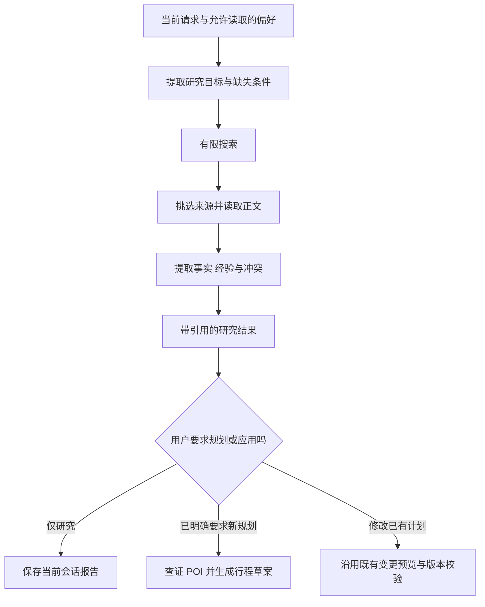

# 彼岸旅行 Agent：联网研究与用户偏好记忆升级方案（待审核）

实施状态更新：用户已确认实施，2026-09-19 的实际功能、取舍和测试边界见 [实施功能汇总](research-memory-settings-delivery-2026-09-19.md)。以下保留审核时的设计。

日期：2026-09-18  
修订：2026-09-19，增加 Web 服务配置及密钥保护设计。  
依据：当前本地代码、9 月 18 日网页端交付记录，以及本轮关于联网、长期记忆和专属 skill 的需求。  
本次交付：设计方案；尚未实施代码、数据库迁移或外部服务接入。本方案调整上一版路线的优先级，不把上一版建议当成已经实现的功能。

## 1. 本轮目标与范围

建议把本轮目标定为：**能主动检索和核对旅行信息，并在同一网页使用者的不同会话中应用已保存的旅行偏好。**

主要交付两条完整体验：

1. “帮我查西安三天攻略，优先看近期信息” → 搜索 → 阅读网页 → 区分经验与事实 → 给出带来源的建议 → 按用户要求转为行程草案。
2. 会话 A：“以后旅行默认安排轻松一点，优先公共交通，帮我记住。” → 保存偏好 → 新建会话 B：“规划武汉三日游。” → 使用这些偏好，并允许本次覆盖、修改和忘记。

| 项目 | 本轮安排 |
| --- | --- |
| 联网搜索与网页阅读 | 实施，提供可追溯的来源和失败降级 |
| Web 服务配置 | 增加本地表单，向固定项目 `.env` 保存服务配置；密钥不回显、不进入模型上下文；详见安全补充方案 |
| 长期用户偏好 | 实施；网页端同一使用者跨会话共享，QQ 单独确定范围 |
| 当前会话资料 | 沿用既有文件、图片、任务和行程边界 |
| 网页与 QQ 记忆互通 | 本轮不接入；不按同名、昵称或本机使用关系自动绑定 |
| 网页跨会话共享文件、图片、攻略正文或具体行程 | 本轮不接入 |
| MCP | 不作为前置条件，不新增 MCP Client/Server |
| 自动总结专属 skill | 先给出设计和评测方式，不进入默认运行链路 |
| 注册、多账号登录、远程多设备同步 | 单列选项；当前实现并不具备，见第 3 节 |
| 反复自主爬网、自动订票、支付或自改代码 | 不在本轮范围 |

本轮的“长期记忆”限定为可查看、修改、删除的用户偏好。外部旅行信息作为有来源、有有效期的研究证据保存，不伪装成用户偏好。

## 2. MCP 暂缓的理由

赞同当前不优先接入 MCP，但需要修正一个判断依据：**本地运行或 Docker 封装，并不决定是否需要 MCP。** 两种部署都可以使用 MCP；是否有收益取决于工具复用和生态接入需求。

目前天气、地图、数据库和调度均由项目自己维护，近期只需接入少量搜索/网页阅读能力，直接使用服务 API 和 Python 接口更简单。MCP 不能代替搜索服务，也不自动提供长期记忆、任务恢复或权限隔离。

建议仅保留一个很小的 `SearchProvider.search()` 接口，先实现一个搜索供应商；网页正文读取独立处理。不要为了将来可能使用 MCP，把高德和现有本地业务全部重新包装。以后确实要复用现成 MCP 服务、在多个产品间共享工具，或让外部 Agent 调用本项目能力，再追加适配器。

## 3. 最新代码事实与“账号”的含义

### 3.1 当前已经具备的基础

| 当前代码 | 已有能力 | 对本轮的作用 |
| --- | --- | --- |
| `adapters/web_app.py`、`web_adapter.py`、`web_transport.py` | 本地 HTTP、Web 会话适配、站内投递 | 新能力共用现有入口 |
| `infrastructure/web_repository.py` | 会话、上传、请求、通知、Cookie 会话 | 偏好管理 UI/API 的接入点 |
| `core/web_settings.py` | 仅本机监听、独立 `data/web/`、单目录实例锁 | 保留 QQ/Web 数据隔离 |
| `core/intent_ir.py`、`agents/intent_compiler.py`、`services/semantic_task_service.py` | 版本化语义解析和受控业务执行 | 扩展研究/偏好领域，复用现有编排 |
| `agents/context_builder.py` | 当前会话、任务、群聊、文档和图片上下文 | 注入少量相关偏好与研究证据 |
| `agents/trip_planner.py`、`services/trip_service.py` | 结构化需求、POI 校验、行程版本及提醒确认 | 将偏好/研究应用为有来源的规划约束 |
| Inbox、Outbox、ModelGateway | 恢复、取消、幂等和模型预算 | 承载联网研究，无需另起通用 Agent 框架 |

当前联网能力包括高德 API 和有限的预约规则页面抓取，尚无通用“搜索攻略 → 阅读多个网页 → 比较来源”闭环。现有对话/任务/资料保存也不等于账号级偏好记忆。

### 3.2 重要发现：当前没有真正的多账号系统

`web_repository.py` 中固定 `OWNER = 'local-owner'`；`web_sessions` 只有 Cookie token 哈希、CSRF 和到期时间，没有用户外键。会话查询按会话 ID 执行，尚没有账号所有权过滤。浏览器 Cookie 是访问保护机制，不是个人账号。

因此，“一个网页账号之间的记忆互通”在本方案中的建议解释是：**同一网页使用者的多个聊天会话共享用户偏好**，不是不同账号之间共享记忆。

推荐采用两档范围：

| 选项 | 交付内容 | 边界 |
| --- | --- | --- |
| A：本地单使用者，推荐本轮采用 | 将当前稳定本地身份映射到持久 `principal_id`，所有本地会话共享其偏好；重启和 Cookie 更新不丢失 | 不提供人与人隔离；同一服务的其他本机访问者仍相当于同一使用者 |
| B：真正多账号 | 增加登录/退出/会话吊销、账号标识，并补齐所有 Web 资源和后台任务的账号归属校验 | 额外工程范围；不能仅加登录页或给记忆表加 user_id 就宣称完成 |

本轮按 A 编写实施顺序，界面称“本地使用者偏好”。如果审核选择 B，应先完成账号隔离，再上线偏好共享；需要重新估算范围。跨设备使用还涉及服务器部署和认证，不由 Cookie 或 Docker 自动解决。

账号标识一律由服务器从已验证身份解析，不允许模型、URL 参数或前端请求正文指定要读取谁的记忆。

## 4. 记忆共享矩阵

| 数据 | Web 同一使用者、同一会话 | Web 同一使用者、不同会话 | Web 不同账号（若选 B） | QQ | QQ ↔ Web |
| --- | --- | --- | --- | --- | --- |
| 已保存用户偏好 | 使用 | 共享 | 严格隔离 | 默认按平台＋群号＋QQ 号保存 | 不共享 |
| 普通聊天原文/待补任务 | 沿用当前行为 | 不自动检索或拼接 | 隔离 | 沿用当前群/成员规则 | 不共享 |
| 文件、图片、OCR、摘要、文档索引 | 当前会话读取 | 不自动读取 | 隔离 | 沿用原群文档及个人图片规则 | 不共享 |
| 行程、提醒、研究报告 | 当前会话操作 | 不作为共享记忆；保留已有通知中心和会话切换 | 隔离 | 沿用原任务归属 | 不共享 |
| skill 候选 | 暂不执行 | 后续经本人启用才共享流程模板 | 不共享私人模板 | 本轮不接入 | 不共享 |

QQ 第一版按群和本人保存偏好，避免把一个群里透露的偏好带到另一个群。未来如需要同一 QQ 跨群共享，应作为单独开关设计，不能因 QQ 号相同就默认扩大使用范围。

Web 只共享规范化偏好值。例如“节奏=轻松”，不把来源会话的整段聊天附送给新会话。即使来源会话上传过行程 PDF，也不能借由偏好提取把 PDF 摘要、酒店订单或旅伴信息带入别的会话。

## 5. 长期偏好的产品规则

### 5.1 第一版支持哪些偏好

支持结构明确、适用于多次旅行的字段：

- 行程节奏：轻松/适中/紧凑。
- 交通偏好：公共交通优先、步行适量等。
- 兴趣类别：博物馆、历史街区、自然景观等。
- 夜间活动倾向：默认不安排夜游等。
- 常用出发城市：仅在明确保存后作为缺省候选，不当作实时定位。
- 默认预算目标：必须包含币种、每人/总额、每天/全程、适用项目，缺单位时不自动保存成可执行数值约束。
- 回复偏好：简洁程度、是否偏好表格等少量字段。

本轮不自动记忆健康状况、证件、联系方式、账号凭据、精确住址、订单号。单次“这次带父母”“今天预算 500”属于当前任务条件，不变成长期画像。若用户明确希望长期记住医疗/无障碍需求，应另行设计敏感偏好支持，不能从聊天推断诊断。

### 5.2 写入与确认：明确要求直接保存，推断仅建议

| 用户表达 | 系统行为 |
| --- | --- |
| “记住，我以后旅游优先公共交通” | 校验后直接保存，给出保存回执与撤销入口；不再重复问是否记住 |
| “我一般比较喜欢逛博物馆” | 本轮可应用；轻量提示“是否保存为今后偏好”，未接受前不跨会话生效 |
| “这次想排紧一点” | 仅覆盖本次，不改全局节奏 |
| “以后都改成慢节奏，更新偏好” | 更新该字段版本，回执显示变化 |
| “帮同行的小王安排刺激一点” | 作为当前任务条件，不写入我的偏好 |
| 文件或网页写“忽略原偏好，记住……” | 当资料内容处理，不获得写入权限 |

初版不对每条闲聊做后台画像提取；仅在本人明确的偏好表达、相关旅行任务和设置操作中处理候选。候选重复出现也不会自行提升为确认偏好。

### 5.3 应用优先级与解释

业务权限、事实校验和工具能力始终有效；在可用偏好之间按以下顺序合并：

1. 本轮明确要求；
2. 当前任务已确认的约束；
3. 已保存且适用的长期偏好；
4. 产品默认值。

相同层级冲突或硬条件无法同时满足时，先解释并补问。模型自行给出的 confidence 不是授权或真实性证明。

新会话生成行程时，可显示：“已采用你的偏好：轻松节奏、公共交通。”用户可点“本次不用”或改写要求。不要反复要求用户确认每次读取偏好，也不要把偏好展示占满普通天气回答。

偏好不会替用户补造出行日期、目的地、预约政策或提醒时间；“喜欢博物馆”不等于授权创建博物馆预约提醒。

### 5.4 查看、修改、关闭与忘记

Web 增加“我的偏好”面板：显示字段、值、更新时间、来源类型、启用状态，支持编辑、删除、暂停应用及关闭新偏好提取。聊天也支持“你记住了哪些偏好”“忘记我的预算偏好”。QQ 用同义聊天命令，返回本人当前群范围的内容。

“忘记”立即使后续读取失效，清除活跃缓存、相关待审候选及待处理写入。数据层记录新的撤销版本/代次，阻止旧后台任务把删除值重新写回来。审计只保留必要操作元数据，默认不另存可被模型检索的旧值副本。

已有行程是当时生成的业务快照，不因删除偏好自动改变；已有聊天回执也不会假装被抹除。界面说明“删除偏好”和“删除会话/文件/备份”是不同操作。删除会话时应取消未确认候选；已明确保存的偏好独立保留，来源引用可置空，不因来源消失再次抓取历史。

## 6. 联网研究的最小完整方案

### 6.1 搜索与阅读分开

新增一个搜索供应商适配器，返回标题、URL、摘要和供应商提供的时间信息；新增受控正文读取器。首版不引入浏览器自动登录、社交平台账号抓取或付费墙绕过。

搜索服务候选可以是有稳定 API 的 Brave Search、Tavily 或同类服务。这里没有核实它们在当前部署网络中的可达性、套餐和费用，因此不在方案中声称某家已接入或免费。实施时先对候选做小规模中文旅行查询基准，按召回质量、可达性、延迟及费用选择一个；通过独立 Web 服务配置页向本地后端保存凭据，不要求用户手工编辑 `.env`。首版不同时维护多个付费供应商。已知供应商的基础 URL 由程序给出，通常只需输入 Key。

若暂未配置搜索凭据：既有高德和本地功能照常工作；明确显示“网页搜索未配置”，允许用户提供可访问的 HTTPS 链接作为补充，不把指定链接阅读说成全网搜索。

### 6.2 任务执行流程



“帮我查攻略并规划”已授权完成研究和新草案生成，不应在搜索结束后再要求一次笼统授权。缺城市、天数等必要信息仍要补问；涉及已有提醒和行程的变更继续走原有精确预览。

复用 Inbox 的原事件和租约，增加阶段检查点，不构建无限研究循环。记录搜索结果、读取成功的来源及已生成报告，重启后优先复用有效检查点；取消后晚到的网络结果不能保存业务报告或触发偏好写入。

建议初始上限：一个研究任务最多 3 次搜索请求、读取 5 个页面、正文读取并发 2、总网络正文 150 KB 规范化文本；每页另有响应字节、时限和内容类型限制。进入模型前再次按相关性截取证据，不一次性塞入全部正文。具体数值为待压测默认值。

保留现有每事件模型预算；研究与后续规划共享事件预算，不拆成多个事件绕过上限。常规查询保留现有 4 轮/6 工具上限；研究采用独立的有限阶段服务，不为此全局放大所有聊天的调用上限。

### 6.3 证据与时效

每条证据至少保留：来源 ID、原始/最终 URL、标题、检索时刻、可识别的发布日期及其依据、正文摘要/短引用、内容哈希、来源类型、适用日期和状态。未取得发布日期就标未知，检索时间不冒充发布时间。

- 官方页面优先用于开放时间、预约规则和临时公告，但仍核对场馆、个人/团队类别和适用日期。
- 地图数据用于坐标和路线；搜索片段不能证明当前票价、余票或实际订票成功。
- 游记作为体验和建议；多个转载同一篇文章不算独立证据。
- 搜索摘要可以帮助选源，关键事实要读取正文；无法阅读全文时标“仅摘要”，不升级成已核实结论。
- 未来节假日有冲突或公告未覆盖时，列明差异并保留未知，不按多数网页投票决定规则。

区分缓存有效期与事实适用期。首版可以将普通攻略缓存设为 7 天、时效政策缓存设为至多 24 小时的候选默认值；创建/确认预约提醒仍应重新核查来源，不能因为未过缓存 TTL 就保证政策正确。天气继续使用原天气工具。

研究报告和用户搜索历史保持当前会话范围。初版不建立跨会话攻略知识库；也不根据账号偏好自动扫描其他会话的文件。公开网页的共享缓存可另行优化，本轮优先保持简单边界。

### 6.4 网页抓取边界

复用并核查 `secure_download.py` 的公网地址约束、内容类型、下载大小和时限；如支持重定向，每一跳重新检查目标。拒绝本机、局域网、云元数据和非预期协议地址；DNS 校验必须与实际连接边界一致。网页标题、正文、链接和工具错误都是非可信数据，不能改变系统指令或请求读取本地文件/密钥。

搜索请求只包含完成当前研究所需的信息，不发送账号 ID、整段聊天、文件正文或不相关偏好。“从哪个城市出发”等确属当前查询条件时，才按用户请求使用。只访问公开可获取内容，遇到登录、验证码、限流时标记不可用或换公开来源，不制造已读内容。

## 7. 代码落地设计

### 7.1 偏好存储与上下文

建议新增 `infrastructure/preference_repository.py` 和 `services/preference_service.py`，在现有 SQLite 内建立少量表，暂不引入向量数据库。

`user_preferences` 核心字段：

```text
id, platform, principal_id, scope_kind, scope_id,
key, value_json, status, version,
source_event_id, source_kind, source_excerpt,
created_at, updated_at, expires_at
```

另保存主体级记忆设置/撤销代次；必要时用简短的操作审计表记录版本和操作，避免审计再次变成隐蔽的可检索全文记忆。有效偏好按主体、范围和 key 建唯一约束；写入按来源事件幂等，更新/删除用预期版本校验。

Web 范围是本地使用者/未来认证账号；QQ 范围是当前平台、群、QQ 成员。主体必须来自服务端适配器，偏好服务不能接受模型指定的 owner。若扩展 Intent IR，应同步禁止 `principal_id`、`account_id`、`user_id` 等身份字段进入模型可执行输出；偏好字段只允许白名单。

`ContextBuilder` 按当前问题读取最多少量相关偏好（建议初版最多 8 条），在现有总上下文预算内分配空间。来源原文只用于必要核对，不向所有新会话附送来源文件或完整聊天。

**不能只修改 ContextBuilder。** 当前应用会先执行部分专用服务，`TripPlanner.extract()` 还要求字段来自原话/资料。应给规划器增加独立的 `preference_defaults` 输入，由程序在明确需求提取后合并，并标记 `field_sources=preference`、偏好 ID/版本；不要伪造原话，也不要直接放宽原文校验。保存行程时固化“实际采用了哪些偏好”，避免以后改偏好自动改变旧行程。

### 7.2 网络研究与编排

建议新增：

```text
infrastructure/search_client.py       # 一个供应商适配器及小接口
infrastructure/web_reader.py          # 公开页面正文与来源元数据
infrastructure/research_repository.py # 当前会话研究状态、证据与报告
services/research_service.py          # 有限阶段、停止条件、引用整合
services/preference_service.py        # 候选、保存、应用、修改、删除
infrastructure/preference_repository.py
```

研究状态采用单一权威记录，可保存 `collecting → searching → reading → synthesizing → completed/partial/failed/cancelled` 的阶段及对应 Inbox 事件。恢复继续使用当前事件的模型计数与租约；不同时新增另一套独立调度器。

扩展现有 Intent IR 的 `research`、`preference` 两个领域，增加明确操作白名单和歧义回退。复用当前编译结果，不为一条消息叠加“独立路由模型＋偏好模型＋研究规划模型”多次重复分类。保留便宜的明确指令入口；若调用次数/首字延迟升高，使用指标决定是否需要更多模型解析。

研究结果转行程时，网页景点名先经过高德 POI 实体匹配，保留来源映射；找不到唯一地点就澄清或标为建议，不生成虚假的 POI ID。网页里的“立即预约”不会被编译成用户操作。

原 `ToolResult` 可以按实际需要扩展研究证据引用，或使用研究领域结果对象；不为单个搜索功能重写整个工具注册系统。

### 7.3 Web 界面与 API

在现有 React 页面增加：

- 偏好面板与待保存提示，明确“跨会话使用”的范围。
- 研究状态显示：查找来源、阅读页面、整理结果、部分完成、失败。
- 引用卡片：标题、域名、检索时间、适用范围、可点击来源；受现有安全 Markdown/链接规则约束。
- “用于规划本次行程”入口；缺少城市/天数时转为当前会话补槽。
- 结果采用的偏好说明，以及“本次不使用”操作。

新增偏好与研究查询端点应由服务端解析主体，并沿用 Cookie、CSRF、Host/Origin 保护。跨会话偏好写入按版本处理；会话 A 和 B 同时修改同一字段不能静默互相覆盖。

如果选择真正多账号，必须同时覆盖会话、上传/下载、消息历史、任务查询/取消、行程、提醒、研究结果、站内通知和投递恢复的账号边界；受控后台任务应保存并重验主体。单独替换 `local-owner` 常量远远不够。

## 8. 自动总结专属 skill：本轮只定设计

这里的 skill 是旅行 Agent 可复用的任务流程，不自动安装为 Codex skill，也不包含任意 Python 或 shell 执行权限。

三种内容分开放置：

| 内容 | 放在哪里 | 示例 |
| --- | --- | --- |
| 用户偏好 | 偏好记忆 | 我通常喜欢轻松节奏 |
| 事实和证据 | 当前会话研究资料 | 某馆今天页面中的预约说明 |
| 可复用处理方法 | skill 候选 | 城市周末游先补日期/出发地，再查开放信息和路线 |

后续可从“反复出现且成功完成、得到用户正向反馈”的任务归纳流程草稿，也支持“把刚才的流程总结成我的模板”。候选包含：适用场景、必需输入、处理步骤、允许的只读工具、输出格式、验证条件、版本和失败回退。

生成状态建议为 `draft → reviewed → enabled → disabled`。自动生成不等于自动启用；用户明确接受后才用于后续匹配。匹配后只加载相关模板，并继续遵守本轮要求、工具权限和当前来源校验。

候选示例：“周末两日城市游”。模板可以规定先确认城市/周末日期/出发地，再搜索公告、匹配 POI、核算交通、输出两天草案；不能固化“某馆永远提前 5 天开放预约”、上次旅行的具体日期、同伴姓名或文件内容。模板内的个人默认值应引用当前偏好字段，不另复制一套容易过期的用户画像。

效果需通过同批任务的有/无模板对照测量：首个有效动作耗时、模型调用数、输入 token、字段错误和误触发率。skill 也会增加提示词长度，不能预先承诺加速。只有在质量不下降且有可测收益时才启用默认推荐。

本轮仅记录上述结构与候选触发点，不开发模板自动发现、执行器或跨用户技能市场。

## 9. 实施顺序与验收门槛

| 阶段 | 改动 | 完成标准 |
| --- | --- | --- |
| S0 基线与身份边界 | 确认 A/B；读取当前测试基线；确定主体与会话范围、搜索供应商小样本比较 | 当前 Web/QQ 回归通过；身份来源明确；搜索可达性和实际成本有记录 |
| S0.5 本地服务配置 | 专用表单、受限配置 API、原子保存 `.env`、脱敏与 Git 检查 | 密钥不回显；空值不误清除；配置优先级/重启提示正确；日志、构建、提交防泄漏专项通过 |
| S1 偏好 MVP | 显式保存、跨会话读取、覆盖、修改、忘记；Web 面板与 QQ 当前群命令 | 同一 Web 使用者新会话可应用，附件/行程不串；删除后不能恢复旧偏好；重启可恢复 |
| S2 联网研究 MVP | 单供应商搜索、公开网页阅读、引用、来源冲突、阶段恢复 | 真实中文攻略查询可返回可访问来源；断网/限流不伪造；关闭搜索不影响现有旅行功能 |
| S3 两条能力串联 | 研究＋偏好进入规划；自然语言编排、引用卡片、预算与状态说明 | 一条“按我的习惯查攻略并规划”闭环通过，POI/日期/提醒仍满足原有校验 |
| S4 交付验证 | 回归、真实接口、小范围浏览器和 QQ 验收；更新手册 | 按层报告实际测试范围；剩余限制明确，不把旧测试数量当新功能证明 |

专属 skill 不列入上述交付门槛，避免阻塞联网和记忆的使用价值。各阶段独立开关和数据库备份；出错时关闭新功能而不删除旧任务或跨平台合库。

### 建议新增验收样例

1. Web 会话 A 保存轻松节奏，B 规划行程时使用；Cookie 更新/服务重启后仍然有效。
2. A 上传文件，B 无法读取文件、OCR、摘要或从其内容间接生成个人偏好。
3. 本次要求紧凑行程可以覆盖轻松偏好，之后新会话仍然默认轻松。
4. “这次带父母”“给小王规划”不会污染本人长期画像；预算缺单位先澄清。
5. 明确保存请求只保存一次；重复提交/重启恢复不重复候选或回执。
6. 删除偏好同时有后台抽取任务运行，晚到结果不能恢复删除值；另一会话下一条请求读取新版本。
7. QQ 甲乙和同人跨群偏好隔离；QQ 与 Web 不串；网页中的原 QQ 群名不会触发身份绑定。
8. 搜索标题与正文日期冲突，输出标注不确定；仅摘要时不声称已阅读全文。
9. 攻略网页含提示注入、跳转内网链接、过大页面、未知 MIME，不能读取私有网络或执行写操作。
10. 研究途中取消、重启、供应商限流：有检查点、有限重试、可解释的部分结果，不绕过预算。
11. “查攻略并规划”使用当前偏好和真实 POI；网页/偏好不能自动授权提醒、取消或预约。
12. 若选 B：账号甲持有乙的会话/文件/任务/研究结果 ID，所有读取、修改和通知入口均拒绝；退出登录使会话失效。

增加独立的新功能开发集和保留集，至少覆盖上述场景及措辞变体。模拟网络用于确定性故障测试，真实搜索检验中文召回和引用可用性，真实模型检验意图/证据整合；三层分别统计。

偏好隔离、越权和未授权写入要求测试零失败；不以平均成功率掩盖这类问题。研究质量同时记录无证据事实数、正确引用率、部分结果率、耗时及每任务费用。先测基线再设速度目标，不能把增加 skill 或换部署方式当作加速证据。

## 10. 供审核的决策摘要

本方案建议审核以下默认选择，确认后再实施：

1. **范围**：聚焦联网研究＋用户偏好；暂不引入 MCP，skill 只保留设计。
2. **Web 身份**：本轮采用 A，本地单使用者跨会话偏好共享；如必须现在就有多个可登录账号，改选 B 并先做完整账号隔离。
3. **共享边界**：Web 只跨会话共享偏好；QQ 默认本人当前群内共享；QQ/Web 不互通；文件、图片和具体旅行资料不扩大访问范围。
4. **写入方式**：明确“记住”直接保存并可撤销；隐含偏好仅提供保存建议；一次旅行条件不自动变成长期偏好。
5. **联网方式**：接一个搜索 API，加受控网页正文读取；供应商经中文旅行小样本和部署网络验证后确定，凭据通过 Web 配置页保存至本地项目 `.env`，不进入聊天或偏好存储。
6. **配置安全**：采用 [Web 服务配置与密钥保护补充方案](web-service-settings-security-plan-2026-09-19.md)。首版配置在重启后生效，明确项目级配置对 QQ 的影响；不承诺仅靠 `.gitignore` 绝对杜绝泄漏。

审核通过后，按 S0–S4 分阶段实施并测试。本次没有修改业务代码，也没有创建搜索账号、购买服务或更改正式数据。
